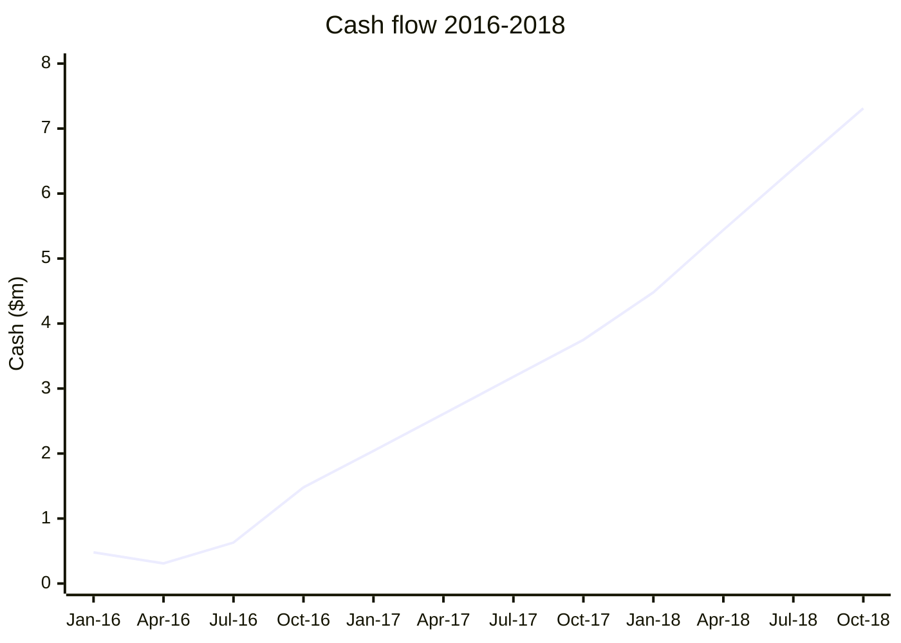
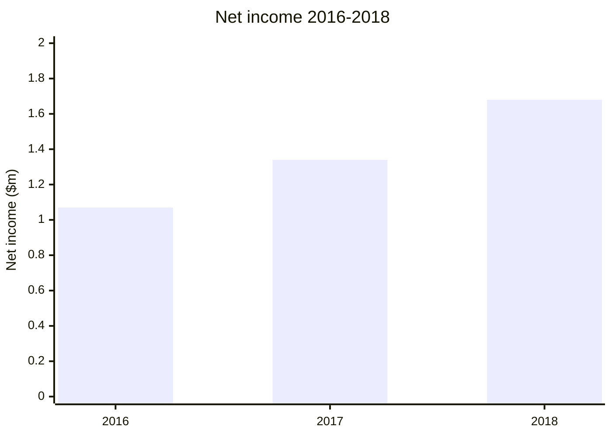
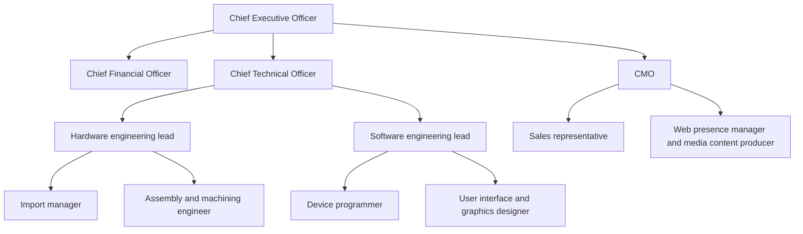

This page transcribes the full 2015 DECA Entrepreneurship
Written Event business plan into Markdown.

## Entrepreneurship Written Event

**ENTREPRENEURSHIP WRITTEN EVENT**

**oneBand LLC**

Interlake DECA

Interlake High School

16245 NE 24th Street

Bellevue, WA 98008

Pramod Kotipalli

January 2015

## Contents

- [I. EXECUTIVE SUMMARY](#i-executive-summary)
- [II. INTRODUCTION](#ii-introduction)
- [III. ANALYSIS OF THE BUSINESS SITUATION](#iii-analysis-of-the-business-situation)
  - [A. Self-analysis](#a-self-analysis)
  - [B. Trading area analysis](#b-trading-area-analysis)
  - [C. Market segment analysis](#c-market-segment-analysis)
  - [D. Analysis of potential locations](#d-analysis-of-potential-locations)
- [IV. PLANNED OPERATION OF THE PROPOSED BUSINESS/PRODUCT/SERVICE](#iv-planned-operation-of-the-proposed-businessproductservice)
  - [A. Proposed organization](#a-proposed-organization)
  - [B. Proposed product/service](#b-proposed-productservice)
  - [C. Proposed marketing strategies](#c-proposed-marketing-strategies)
- [V. PLANNED FINANCING](#v-planned-financing)
  - [A. Projected income and expenses](#a-projected-income-and-expenses)
  - [B. Proposed plan to meet capital needs](#b-proposed-plan-to-meet-capital-needs)
- [VI. CONCLUSION](#vi-conclusion)
- [VII. BIBLIOGRAPHY](#vii-bibliography)
- [VIII. APPENDIX](#viii-appendix)

## I. EXECUTIVE SUMMARY

OneBand is a limited liability company that provides
technology products that enable our users to take charge of
their health with truly actionable health insights. oneBand
LLC offers a Health Band and Health Monitoring service that
track a wide variety of health/fitness metrics and, in turn,
predict diseases/conditions (such as diabetes or high blood
pressure) upon which the user can act to improve their
lifestyle and overall health.

> **MISSION STATEMENT:** oneBand LLC aims to help
> individuals lead healthier lives by offering them
> predictive and preventative health notices based on truly
> actionable health metrics thus reducing the costs and pain
> associated with long-term curative medication and
> procedures.

**Types of product/service: oneBand LLC will have two
revenue streams:**

1. oneBand Health Band: Although built upon a smartwatch
   form factor, this health/fitness band will offer users
   more actionable health metrics by measuring blood glucose
   and blood lipid levels (with electric and laser-based
   sensors) that track health behaviors in addition to the
   market standard GPS sensor, heart rate monitor, and
   accelerometer that track fitness behaviors. This product
   will sell through retail and direct-to-customer
   distribution channels at $199.99.
1. oneBand Health Monitoring Service (HMS): This
   software/web app accompanies the Health Band curates all
   data it collects. The HMS analyzes this data, identifies
   concerning trends, and alerts the user of the potential
   of developing lifestyle diseases such as heart disease,
   diabetes, or high/low blood pressure. The HMS also allows
   users to set fitness goals and can relay the selected
   data to a doctor for applications such as outpatient
   tracking/monitoring. It will be available online as a web
   app and on major mobile platforms. This is a subscription
   service charged at a rate of $15 per month.

**Target market analysis:**

1. Focusing on adults ages 18-55 in King County, Washington
   State
1. Target cities: Seattle, Bellevue, Redmond (all in King
   County, WA)
1. Target users have high (discretionary) incomes and
   experience with high-tech products
1. Target market is very active in outdoor activities and
   are health-conscious and fitness-oriented
1. Headquarters in Bellevue, WA: labor pool has significant
   experience with tech/software development
1. Access to medical consultants in major medical research
   intuitions (e.g. University of Washington)

Strategic competitive advantage: oneBand LLC is the only
provider of smart watches/band that track vital health
metrics such as blood sugar and cholesterol for truly
actionable health notifications that predict the development
of lifestyle diseases. Our users will be able to effectively
monitor their exercise, sleep, food, and body routines
throughout the day to gain truly actionable insights as to
their health and well-being. Further, oneBand is the only
technology company that seeks to work with medical
professionals to develop software that identifies concerning
trends in our users’ long-term health so that we can inform
our users to take corrective action and avoid expensive,
curative medical care in the long-term.

> **Financial highlights/request:** I will invest $200,000
> from my private funds into oneBand LLC. I am requesting a
> loan of $500,000 that will be paid back over three (3)
> years with an interest rate of 4.0%. With this loan,
> oneBand will enough funds to ensure a successful startup,
> liquidity, continued product/software development, and
> product marketing.

_Cash flow projection for 2016 through 2018._

_Net income projection for 2016 through 2018._

## II. INTRODUCTION

_The Microsoft Band tracks a user’s location and heart rate
throughout exercise in an attrative package but it cannot
predict preventable lifestyle diseases._

The past few years have been witness to a meteoric rise in
wearable technology[^1]. Wearable technology is a category
of the mobile high-tech industry that allows users
hands-free communication as well as the ability to monitor
one’s health/fitness in the form factor of common wearable
articles of clothing such as a watch or pair of glasses.
Such devices include their independent processing
capabilities and usually feature biometric sensors such as
heart-rate monitors and location/movement trackers. In the
past year, there have been major developments within this
category as processors, sensors, and manufacturing have
become increasingly inexpensive. As such Apple, Samsung,
Google, and Microsoft have all release their own iterations
of the smart watch and health/fitness band (more
information/sources on this topic can be found in the
Bibliography, page 27). However, each of these products
offer very superficial tracking and do not predict
preventable lifestyle diseases; all the technology is
available for such an actionable health service, but no
company has executed upon this important application of
wearable technology so that they can take charge of their
health with prophylactic solutions that reduce the costs of
expensive curative operations in the long-term. As such,
oneBand aims to increase the usefulness of wearable
technology and machine learning pattern identification
software in the aim of fundamentally improving our lives by
eliminating the prevalence of expensive lifestyle diseases.

> **MISSION STATEMENT:** oneBand LLC aims to help
> individuals lead healthier lives by offering them
> predictive and preventative health notices based on truly
> actionable health metrics thus reducing the costs and pain
> associated with long-term curative medication and
> procedures.

At oneBand, we understand that users expect a fluid,
feature-filled product that will help them lead a better
life. As such, we are committed to constantly improving and
expanding features in our product and service alongside
developments in the industry and the needs of our customers.

In summary, oneBand LLC will have two revenue streams: the
sale of the Health Band health/fitness tracker and smart
watch, and the subscription Health Monitoring Service.
Organized as a limited liability company offering profit
incentives for employees, oneBand LLC will provide a Health
Band that can track such vital metrics as heart rate, blood
sugar, and blood pressure. Further, the accompanying Health
Monitoring Service will be offered as an app on major
software platforms and will identify patterns in the
collected data to predict and alert users of the development
of concerning lifestyle diseases. oneBand will target adults
in King County, WA, an area where people are proficient with
technology, have high discretionary incomes, and have a
demonstrated interest in health/fitness and outdoors
activities. The Health Monitoring Service will be offered on
both desktop and mobile operating systems as subscription
service integrated with the Health Band.

**Advisors/mentors:**

Krishna Kotipalli: My father is an outstanding mentor for
this DECA paper because he has over 20 years of experience
in the high technology industry working at Microsoft as a
senior software development engineer. He is a very-well
informed technologist who inspires me to think creatively
about technology’s applications in our world.

Srivani Eluri: My mother has significant experience working
with cloud-based technology services during her continuing
15-year tenure at Microsoft. As such, she has extensive
knowledge of machine learning techniques and big data
processing. She encourages me to explore technology and
embrace the power of the internet in an increasingly
interdependent world.

Lasinnda Mathewson: Ms. Mathewson is the International
Baccalaureate Business and Management teacher at Interlake
High School and has over 20 years of experience in business
and marketing education. Ms. Mathewson has guided me as I
wrote this paper by clarifying my ideas and encouraging me
to increase the feasibility of these ideas in the
marketplace.

## III. ANALYSIS OF THE BUSINESS SITUATION

### A. Self-analysis

I, Pramod Kotipalli, have significant experience with
business/management and technology through DECA and my
self-studies in computer science and software development.

Firstly, I have been a member of DECA for the past three
years and I have been a finalist in the Washington State
Career Development Conference in the Buying and
Merchandising Team Decision Making and Automotive Services
Marketing events. This experience in particular has
developed and expanded my knowledge of retail buying
operations and distribution channels for commercial goods.
In addition to DECA, I avidly read business, technology, and
political news through periodicals such as The Economist,
WIRED, and Al Jazeera. Such interest in business,
technology, and global commerce enables me to be very well
versed in the high-tech industry as well as the execution of
business through an understanding of the concepts of
finance, marketing, business organization, and operational
strategy.

Secondly, I have significant experience with computer
science and software development. I am fluent in HTML, CSS,
PHP, and JavaScript and have been developing applications
with Leap Motion and Google Apps Script in Java and Python
for the past few years. Such technical knowledge allows me
to effectively implement my ideas in technology into useful,
market-ready products. More recently, I have interned at a
local technology company that develops an application for
anonymous social networking. At this internship, I have
learned about software/product development, product/project
management, and the skills required to bring a technology
product to market.

Finally, I have significant experience with leadership in
school. I was elected class officer by my peers where I have
raised funds for our senior year’s graduation and prom
events. As class officer, I organized, planned, and executed
multiple fundraisers that have raised thousands of dollars.

I believe that my extensive experience with business
concepts, computer programming, product management, and
leadership will allow me to effectively lead oneBand LLC in
the demanding technology industry. These skills will allow
me to effectively manage employees, work with manufacturers,
pilot marketing content, and lead oneBand LLC in keeping
with our Mission Statement.

I am also willing to learn and take risks as oneBand grows:
I will always be open to employee feedback as to how to
become a more effective communicator and manager. As I am
investing $200,000 in this mission that I believe in, it is
clear that I am willing to take well-informed risks. As
such, I believe, under my leadership, oneBand LLC will
become a profitable, industry leader in the category of
health/fitness bands.

### B. Trading area analysis

#### 1. General data: geographic, demographics, economics

Geographic: King County in Washington State (focusing on the
Bellevue and Seattle metropolitan areas) is ideal for
oneBand because of the area’s strong technology
infrastructure, the area’s prevalence of high-tech
corporations/research, and Seattle’s numerous, top-ranked
medical facilities and resources. These elements are vital
for a company such as oneBand that provides a
health-oriented product and service. In terms of
technological infrastructure, the Seattle-Bellevue-Redmond
area will superbly support oneBand’s growing technology
needs. For example, CenturyLink’s nationwide fiber optics
network has been expanded through Seattle and Bellevue[^2]
and can provide “gigabit” speeds of over 1000 megabits per
second, demonstrating the continued growth of a strong
technological infrastructure; such high speeds will allow
our users to enjoy a fast, fluid experience as they use our
Health Monitoring service. Further, with the headquarters of
major technology companies such as Microsoft and Amazon in
oneBand’s geographic trading area, oneBand will be able to
work closely with these companies to improve the quality of
our product’s sensors and services. For example, Amazon’s
headquarters in Seattle will allow us to work closely with
them to develop a web-based application for our Health
Monitoring service using Amazon’s HIPAA-compliant[^3] Amazon
Web Service (AWS) thus saving costs on database management
while maintaining the integrity of our user’s health data.
In addition, we can work with Amazon to store oneBand’s
product inventory with Amazon’s Inventory Management[^4]
system in order to provide a responsive and cost-effective
solution that provide retailers and customers with our
Health Band product.

| Washington State                                                                                                                                          | Seattle-Bellevue-Redmond                                                                                                                                                             |
| :-------------------------------------------------------------------------------------------------------------------------------------------------------- | :----------------------------------------------------------------------------------------------------------------------------------------------------------------------------------- |
|  |  |
| _King County within Washington State (Google Maps)._                                                                                                      | _The Seattle-Bellevue-Redmond trading area._                                                                                                                                         |

Finally, the Seattle-Bellevue-Redmond area is also saturated
with top-ranked medical facilities, centers, and schools
making it one of the highest areas of medical research
activity in the country. For example, the top-ranking
University of Washington and its network of nationally
ranked medical centers throughout the region[^5] provides an
excellent resource for new medical technologies for the
Health Band and trends to track in our Health Monitoring
service. In addition, the area’s highly-experienced medical
professionals can serve as consultants/advisors in
developing our Health Monitoring Service. The unique
combination of a strong technology and medical scene makes
King County and the Seattle-Bellevue-Redmond area the
perfect geographical trading area for oneBand.

Demographics: King County, WA is renowned in Washington
State and the greater Pacific Northwest for its hiking and
biking trails that attract millions of enthusiasts to the
outdoors every year. Such interest in the outdoors and in
fitness is illustrated by such now-national outdoor
recreation gear retailers like Recreational Equipment, Inc.
which found its origins in Seattle, WA. The region’s general
affluence has also spawned well-known fitness clubs and
brands such as PRO Sports Club and the Bellevue Club, two
organizations that illustrate a focus on fitness and health
in King County, WA. As such, we intend to sell in retailers
such as REI, Sports Authority, and BIG5, as well as in
sports clubs in the area.

Further, city-level lawmakers are taking extra initiative to
promote alternative forms of transportation by designating
and incentivizing walking, biking, and overall
health-oriented behaviors. As such, the number of bikers,
hikers, and exercise enthusiasts continues to grow in King
County, WA.

Economics: Washington State is the ideal market in which to
trade because of the various tax credits available to
companies in the high technology industry. First, OneBand
can claim “High Technology R&D Expenditures” as a Washington
State Business & Occupation Tax Credit[^6] meaning that any
research or technological infrastructure investments we make
can be deducted from our tax filing. Secondly, oneBand can
claim “High Technology Deferral” on sales/use taxes[^7]
meaning that oneBand’s tax liabilities on technology assets
and subscriptions are not realized until a future date in
oneBand’s accounting period. For example, income from an
annual OneBand Health Monitoring subscription of $180 paid
at the beginning an accounting period will not be fully
taxed in the period that that subscription has been
purchased; if only $45 is utilized in a particular
accounting period, then only those $45 will be taxed as
Washington State income taxes. Such tax credits and
deferrals are highly conducing to growth and expansion in
Washington State.

#### 2. Competitive data

Present competitors (listed and briefly described),
competitive advantages and disadvantages of the proposed
business: The table below outlines and evaluates oneBand’s
competitors

| Competitor                                  | Cost                  |
| ------------------------------------------- | --------------------- |
| Android Wear (by Google)                    | varies: $150-$300     |
| Apple Watch                                 | expected price: >$300 |
| Microsoft Band                              | $200                  |
| Fitbit Surge (fitness-oriented smart watch) | $250                  |

**Android Wear (by Google)**

Advantages:

- utilizes popular Android OS\*\*
- provides suite of integrated smart watch services such as
  navigation, music playback, communication, etc.
- smart watch OS runs on devices of numerous third party
  device manufacturers (outside of Google)

Disadvantages:

- fitness tracking application of device only utilizes
- fitness tracking limited only to heart rate and footsteps
- no comprehensive service to predict disease so user can
  take preventative action
- confusing UI\*/OS\*\* for non-expert users

**Apple Watch**

Advantages:

- supported by massive brand value of Apple
- potential for many third-party app integrations in
  addition to watch, health, and communication
  functionalities
- appealing UI\* and external design
- personalized fitness goals systems

Disadvantages:

- health app only available on iOS devices (iPad, iPhone,
  and iPod)
- watch and app provides only simple metrics (e.g. heart
  rate, user motion, location)
- no system to inform users on potential diseases developed
  by exercise; not a preventative-based service

**Microsoft Band**

Advantages:

- simple UI/graphics design
- accompanying “Microsoft Health” app provided on all three
  major mobile platforms (iOS, Android, Windows Phone)
- heart rate, sleep, and calorie tracking
- focus on productivity for business clients
- integrated with various fitness-related applications

Disadvantages:

- goal setting functionality lacks
- provides 24/7 tracking claiming “actionable” health data
  but doesn’t provide suggestions for how users can improve
  lifestyle based on health metrics (known as “Microsoft
  HealthVault”)
- oversimplified UI\* with limited screen real estate for
  productive tasks

**Fitbit Surge (fitness-oriented smart watch)**

Advantages:

- continuous heart-rate monitoring
- differentiates between various sports/activities
- watch face provided in addition to alarms and
  notifications
- battery life of up to 7 days
- comprehensive online service coupled with apps on all
  major OS\*\* platforms

Disadvantages:

- health/fitness data is limited to heart rate, user
  motions, a location data
- online service doesn’t extend to identifying and alerting
  the user of concerning health trends

\* “UI” is an abbreviation for user interface; \*\* “OS” is
an abbreviation for operating system

oneBand’s competitors all offer attractive, premium-priced
devices compatible with only a few mobile device platforms
per device. However, one element absent in all of these
devices: a truly actionable health monitoring system.
Although heart rate and location tracking offer useful data
about exercise and sleep routines, truly actionable results
stem only from useful health metrics such as glucose,
cholesterol, blood pressure, and blood fat levels. In this
field of competitors, only oneBand is poised to offer the
tracking of these vital health statistics in an actionable
way that still provides the attractive, well-priced, and
productive features required of health/fitness bands today.

The advantages and disadvantages of oneBand LLC in
comparison to its competitors are detailed in a SWOT
(Strengths, Weakness, Opportunities, Threats) analysis which
assesses a business’ internal and external factors related
to its business situation and growth (see Appendix A, page
28).

### C. Market segment analysis

Because of the legal complications involved with providing
minors with medical advice through our Health Monitoring
service, only adults over the age 18 will considered in our
market segment. As such, we have refined oneBand’s target to
residents of the Seattle-Bellevue-Redmond area between ages
15 to 55 of those people with access to modern technology
and high-speed internet. Below we further define our target
market:

_Population pyramid for people aged 18 to 55 in King County,
WA[^8]_

There are 1.085 million people aged 18 to 55 in King County,
WA thereby defining the maximum size of our target
demographic. However, this number does not represent the
number of people with internet access and a computer or
smartphone.

Below is table outlining internet access by home computer or
smartphone in the U.S. as a whole:

| Internet access through smartphones or at home in the U.S., by age (in thousands)[^9] |         |                     |      |                  |      |         |      |
| ------------------------------------------------------------------------------------- | ------- | ------------------- | ---- | ---------------- | ---- | ------- | ---- |
| Total 15 + years                                                                      | 243,689 | Home internet users |      | Smartphone users |      | Either  |      |
| Age                                                                                   | Total   | Number              | %    | Number           | %    | Number  | %    |
| 25-34 years                                                                           | 41,408  | 30,839              | 64.5 | 27,896           | 67.8 | 35,683  | 86.2 |
| 35-44 years                                                                           | 39,478  | 30,426              | 77.1 | 23,235           | 58.9 | 33,630  | 85.2 |
| 45-54 years                                                                           | 43,882  | 31,225              | 71.2 | 19,777           | 45.1 | 33,903  | 77.3 |
| Total for ages 25-54                                                                  | 124,768 | 9,249               | 70.9 | 70,908           | 57.3 | 103,216 | 82.9 |

Thus, it can be extrapolated that in King County, that about
(or at least) 82.9% of King County residents have internet
access through one of the many software platforms supported
by oneBand on a smartphone or computer. Thus, about people
aged 18-55 in King County define our target market.

Finally, the residents of our trading area can economically
support the costs of our product. The histograms below
illustrate that there is concentration of wealth in King
County, Washington meaning that there many more
higher-earning families in our trading area thus
contributing to a greater discretionary income for the
innovative medical goods provided by oneBand. In other
words, our trading area can very much support the costs of
oneBand’s services.

| King County                                                                                                                                        | United States                                                                                                                                          |
| :------------------------------------------------------------------------------------------------------------------------------------------------- | :----------------------------------------------------------------------------------------------------------------------------------------------------- |
|  |  |
| _King County household income distribution._                                                                                                       | _United States household income distribution._                                                                                                         |

Positioning is very important for creating a place in the
customer’s mind for oneBand’s product and service. Below are
the four Ps of the marketing mix that come together to
define oneBand and its product and service for our market
segment:

1. Product: oneBand’s product and service, the Health Band
   and Health Monitoring Service, will create a demand
   amongst adults concerned with preventing expensive
   lifestyle diseases by use of actionable health metrics
   from mobile/wearable technology.
1. Place: oneBand LLC is targeting individuals in King
   County who are proficient with technology, have
   significant discretionary income, and are interested in
   health/fitness products and well-being.
1. Price:
   - oneBand’s Health Band is priced in the same price range
     as our competitors. The typical price of a smart watch
     with health/fitness features ranges from $150-$350 with
     most competing products (Android Wear and Apple Watch
     specifically) significantly priced above $200. Thus,
     oneBand’s price of $200 has a competitive price while
     maintaining the air of a premium product.
   - oneBand’s Health Monitoring Service is priced
     strategically at $15 per month. Most competitors have
     health/fitness tracking services that are free with the
     purchase of an expensive mobile device and band but
     these services do not offer features that lack in
     quality and are not in any way comparable to those of
     oneBand. In addition, most premium internet services in
     music and entertainment are priced from $10-$15. Thus,
     a price of $15 per month is a fair ask considering the
     benefits we offer our users.

1. Promotion: oneBand LLC will utilize both above-the-line
   and below-the-line promotion in our marketing endeavors.
   For above-the-line promotion, oneBand will purchase
   advertisement space in various mass-circulation magazines
   including WIRED and Seattle Metropolitan. For
   below-the-line promotion, we will send informational
   emails to our current and interested users. We will also
   actively support charities such as the American Heart
   Association and the American Diabetes Association. In
   addition, we will offer a discount for our early adopter
   customers. A full promotional plan is elaborated further
   in Section IV-C under “Proposed marketing strategies.”

### D. Analysis of potential locations

After extensive research, I have narrowed down potential
locations for oneBand to the Bellevue Technology Center or
offices in downtown Bellevue which both have significantly
lower operation/lease costs than offices Seattle or Redmond,
the two other major cities in our trading area of King
County.

| Element of potential location analysis          | Bellevue Technology Center (NE 24th Street Bellevue, WA)[^11]         | Bellevue Pacific Center (106th Ave NE, Bellevue, WA)[^12] |
| ----------------------------------------------- | --------------------------------------------------------------------- | --------------------------------------------------------- |
| Environment                                     | Calm suburban                                                         | Busy urban                                                |
| Square footage in rentable square footage (RSF) | 5,725 RSF                                                             | 3,180 RSF                                                 |
| Long-term lease price; (for three years)        | $6,000 per month                                                      | $9,000 per month                                          |
| Utility expenses                                | Comparable                                                            |                                                           |
| Local amenities/food                            | Limited local shopping, franchise restaurants                         | Diverse cuisines restaurants, shopping                    |
| Housing                                         | Many quality apartments and houses at fair price; near PRO Sport Club | Extremely premium apartments at premium prices            |

Considering all the elements, the Bellevue Technology Center
is the best environment for oneBand’s headquarters. Further,
the Bellevue Technology Center is down the street from the
corporate/global headquarters of Microsoft, a company that
we can work with to further develop or product and service.
Also, Amazon is just a 10 minute drive away from our
intended office location. Finally, employees will have easy
access to quality, affordable housing near work and will be
able to work out at the renowned PRO Sports Club about one
mile from our worksite.

## IV. PLANNED OPERATION OF THE PROPOSED BUSINESS/PRODUCT/SERVICE

### A. Proposed organization

Type of ownership and rationale: oneBand will remain a
limited liability company meaning that the company will be
fully under my control and direction. With this type of
company, we can always raise money from private investors
but not from shareholders in the general public through
avenues such as the stock markets, allowing me to make
decisions regarding the future of the company while
remaining separate from the company in the case of financial
downturn. By keeping the company private, we will not have
to act according to the will of stockholders allowing us to
follow our mission statement and intended goals to their
fullest extent. However, the disadvantages of a LLC are the
legal formations in forming the company. Another
disadvantage is that we must file a more complex tax form
every year while also being required to immediately
recognize profits thereby decreasing the flexibility of
reinvesting cash flow back into the business. Also, selling
shares to raise capital will also be difficult because
equity shares cannot be directly sold to the general public.
This situation may be problematic in times of low liquidity.

Steps to startup: To register and establish oneBand LLC as a
limited liability company in the State of Washington we
will:

1. Seek advice of a lawyer in the state and fill out the
   appropriate forms in regards to RCW 25.15, which deals
   with the registration of LLCs.
1. Fill out a Business License Application (BLS) and apply
   for a Federal Tax Identification number.[^13]
1. Rent out a medium-sized office in Bellevue and purchase
   the required assets such as office equipment, computers,
   and cloud/data services.
1. Hire and orient staff and implement short-term goals and
   initiate talks with hospitals in the target market area.
1. The proposed structure for the company will be outlined
   below including organization, job descriptions, and
   payroll and relevant taxes.
1. I, as owner, find it important to offer a form of equity
   to motivate employees to remain motivated about oneBand
   and its product and service. As such, I will consult with
   a lawyer to offer equity incentives (“profit
   interests”/“profit sharing”)[^14] by way of requesting an
   83(b) election. It is important to note that these are
   non-voting shares in oneBand ensuring I have full control
   over the direction of oneBand in the future.

Organization of company: Here is an organizational chart
illustrating the proposed organization

_Proposed oneBand organizational chart._

**Job descriptions:**

Chief Executive Officer (CEO) & owner: As CEO of oneBand, I
will oversee the entire operation of the business ranging
from product development to effective marketing. I will work
closely with the CTO and technical team to develop and
deliver a product that acts to fulfill our Mission
Statement. I will also work closely with the sales and
marketing team to market our product and build our product’s
retail and web presence. As I will be the representative of
the business to the community, I will also be active with
local business organizations, government councils, and
charities that aim to improve public health.

Chief Financial Officer (CFO): The CFO will be responsible
for maintaining all the financial functions of oneBand
including payroll, tax forms, financial statements, accounts
payable, banking, and the funding of international purchase
orders. The CFO will also work closely with the CEO to keep
me apprised on the cash flow of the business and the
relationship with oneBand’s equity investors and
business/bank loans. The CFO will also be responsible for
managing and paying employee health benefits, ordering
office supplies and technical resources, filing taxes as the
end of each fiscal quarter and year, and working with me to
determine product pricing.

Chief Technical Officer (CTO): The CTO will be responsible
for managing and the product development team and any
oversees manufacturing/sourcing for our product and service.
The CTO will outline product development timelines and work
with the CEO, software engineering lead, and hardware
engineering lead to ensure that development quotas a met in
accordance to user feedback, market trends, and technology
research.

Software engineering lead (SEL): The SEL will manage and
code the software for the oneBand device as well as the
Health Monitoring service by working with local health
academics and professionals from the University of
Washington and local hospitals. Further, the SEL will work
with the CTO to establish and follow through on software
production cycles.

Device programmer (DVP): The device programmer will be the
primary programmer of device software for the oneBand
device. He/she will be responsible for designing and coding
the core software of the device as well as the complimentary
applications for iOS, Android, and Windows Phone devices.
He/she will work closely with the UIX designer to create an
appealing, feature-filled, and easy-to-use suite of software
applications.

User interface and graphics designer (UIX): The UIX designer
will work closely with the device programmer and the CTO to
draft and design icons, brand logos, software graphics in
order to develop an appealing user interface for users.
He/she must have experience with graphic design programs
such as Adobe Illustrator.

Hardware engineering lead (HEL): The HEL will work closely
with the CTO, SEL, and UIX designer to design a
visually-appealing product that is in keeping with oneBand’s
brand, user interface, and graphics. He/she will primarily
employ product design and CAD (computer-aided design)
software to design both the external form and internal
electronics of the device.

Assembly and machining engineer (AME): The AME will
collaborate closely with the HEL and sourcing manager to
locate quality manufacturers of individual product
components and deliver those components to an assembly
facility in China or Taiwan. The AME will also be
responsible for communicating with production facilities to
develop any machines or assembly operations required to
assemble the oneBand product.

Import manager (IM): The import manager will oversee the
delivery of individual components to the production facility
in China or Taiwan. He/she will also manage and oversee the
transportation of the manufactured product to the export
port in East Asia, through a Pacific Ocean shipping vessel,
and to the Port of Seattle where the product will be
transported to a warehouse for distribution to Amazon’s
Fulfillment Centers and retail outlets. The import manager
will also work with the CFO to fill out the appropriate
paper with the federal government to fill out appropriate
paperwork and pay required import/export taxes.

Chief Marketing Officer (CMO): This position requires
passion for the product, service, and mission of oneBand as
well as creativity and experience in product marketing and
branding within the industry of high-technology. He/she will
be required to conduct through market research. Also, the
CMO will work closely with the UIX to develop a uniform and
effective brand image. In addition, the CMO must be able to
sell our product and service through effective sales
presentations for retailers in both physical and online
presences.

Sales representative (REP): First and foremost, the sales
representative must be able to execute effective sales
presentations to entice new retailers in our geographic
trading area to carry our product. He/she must have
excellent presentation and people skills and a passion for
our product.

Web presence manager and media content producer (WPM): As
the reputation of businesses relies more and more on an
effectively managed online presence, an effective manager of
oneBand’s online image is vital. As such, the web presence
manager will curate oneBand’s social media presence as well
as maintain oneBand’s website and blog. In addition, he/she
will be responsible for producing videos and advertising
content for future YouTube or TV campaigns.

**Salaries and equity structure:**

The following table outlines the salary and equity structure
as well as the monthly and annual payroll expenses for
oneBand. Because a sense of personal investment in the
upside of our company will serve as the best motivator for
oneBand’s employees, employees will be offered an equity
stake in the form of an equity incentive (or “profit
interest”) which guarantees a certain percent of the profit
as payout for each employee when oneBand turns a profit;
also, offering equity also justifies paying salaries that
are below market value, thus saving oneBand significant
money in our critical growth phase. It is important to note
that I am still the 100% owner of equity but I am just
opting to share profits to boost employee morale and our
employee’s sense of purpose in oneBand. To comply with the
legal formation of an LLC while still offering a form of
equity, I will, as owner, initiate a 83(b) election to
distribute equity incentives (which are non-voting shares of
no real equity/power value); employees would then be
required to fill out the appropriate paperwork (K-1
statement) to ensure that these revenues are not taxed as
income from their “limited partner” status[^15].

| Position                  | Hourly Rate | Hours in Month | Payroll Expense[^16] |          | Equity incentives/ “Profit interests” | Equity (voting shares) |
| ------------------------- | ----------- | -------------- | -------------------- | -------- | ------------------------------------- | ---------------------- |
| Position                  | Hourly Rate | Hours in Month | Monthly              | Annual   | Equity incentives/ “Profit interests” | Equity (voting shares) |
| CEO, Owner                | -           | -              | $7,000               | $84,000  | 84.50%                                | 100%                   |
| CFO                       | -           | -              | $6,200               | $74,400  | 3.00%                                 | 0%                     |
| CTO                       | -           | -              | $6,700               | $80,400  | 3.00%                                 | 0%                     |
| SEL (software)            | $55         | 120            | $6,600               | $79,200  | 2.00%                                 | 0%                     |
| DVP (devices)             | $50         | 120            | $6,000               | $72,000  | 0.75%                                 | 0%                     |
| UIX (user interface, gfx) | $40         | 120            | $4,800               | $57,600  | 0.75%                                 | 0%                     |
| HEL (hardware)            | $55         | 120            | $6,600               | $79,200  | 2.00%                                 | 0%                     |
| AME (manufacturing)       | $45         | 100            | $4,500               | $54,000  | 0.50%                                 | 0%                     |
| IM (import)               | $40         | 100            | $4,000               | $48,000  | 0.50%                                 | 0%                     |
| CMO                       | -           | -              | $6,000               | $72,000  | 2.00%                                 | 0%                     |
| REP (sales)               | $35         | 120            | $4,200               | $50,400  | 0.50%                                 | 0%                     |
| WPM (web, media)          | $35         | 100            | $3,500               | $42,000  | 0.50%                                 | 0%                     |
| Total                     |             |                | $66,100              | $793,000 | 100.00%                               | 100%                   |

If sales are inadequate during the first year of operation,
the executive team (CFO, CTO, and CMO) and I (CEO) have
agreed to not take a salary from oneBand.

**Payroll taxes and benefits table:**

Below is the payroll taxes and benefits table which outlines
total federal payroll taxes as well as health benefits
offered to our employees. Because our business aims to
create a healthier and actionable, technologically-informed
fitness product and service, I believe it is apt to invest
in the health and fitness endeavors of our staff.

| Position                  | Federal payroll taxes[^17] |                    | Cumulative benefits Rate | Total percent burden | Total Burden upon salary |
| ------------------------- | -------------------------- | ------------------ | ------------------------ | -------------------- | ------------------------ |
| Position                  | Social Security tax        | Total Medicare tax | Cumulative benefits Rate | Total percent burden | Total Burden upon salary |
| CEO, Owner                | 6.20%                      | 1.45 + 0.18%       | 10.00%                   | 17.83%               | $14,977.20               |
| CFO                       | 6.20%                      | 1.45 + 0.18%       | 20.00%                   | 27.83%               | $20,705.52               |
| CTO                       | 6.20%                      | 1.45 + 0.18%       | 20.00%                   | 27.83%               | $22,375.32               |
| SEL (software)            | 6.20%                      | 1.45 + 0.18%       | 20.00%                   | 27.83%               | $22,041.36               |
| DVP (devices)             | 6.20%                      | 1.45 + 0.18%       | 20.00%                   | 27.83%               | $20,037.60               |
| UIX (user interface, gfx) | 6.20%                      | 1.45 + 0.18%       | 20.00%                   | 27.83%               | $16,030.08               |
| HEL (hardware)            | 6.20%                      | 1.45 + 0.18%       | 20.00%                   | 27.83%               | $22,041.36               |
| AME (manufacturing)       | 6.20%                      | 1.45 + 0.18%       | 20.00%                   | 27.83%               | $15,028.20               |
| IM (import)               | 6.20%                      | 1.45 + 0.18%       | 20.00%                   | 27.83%               | $13,358.40               |
| CMO                       | 6.20%                      | 1.45 + 0.18%       | 20.00%                   | 27.83%               | $20,037.60               |
| REP (sales)               | 6.20%                      | 1.45 + 0.18%       | 20.00%                   | 27.83%               | $14,026.32               |
| WPM (web, media)          | 6.20%                      | 1.45 + 0.18%       | 20.00%                   | 27.83%               | $11,688.60               |
| Total                     |                            |                    |                          |                      | $212,347.56              |

### B. Proposed product/service

oneBand LLC will offer one product and one service:

| Product/Service                   | Description                                                                                                                                                                                                                                                                                                        | Pricing                                                                                                                                                                                                                                                                                      |
| --------------------------------- | ------------------------------------------------------------------------------------------------------------------------------------------------------------------------------------------------------------------------------------------------------------------------------------------------------------------ | -------------------------------------------------------------------------------------------------------------------------------------------------------------------------------------------------------------------------------------------------------------------------------------------- |
| oneBand Health Band               | Although built upon a smartwatch form factor, this will offer customers more actionable health metrics by measuring blood glucose and lipid levels with electric and laser-based sensors in addition to the market standard GPS sensors, heart rate monitors, and pedometer.                                       | A complete breakdown of the production costs of this device is provided in the Appendix B, page 29. This product will cost the customer $199.99 through direct-to-customer or retail distribution channels.                                                                                  |
| oneBand Health Monitoring Service | This software curates all data provided by the oneBand Health Band and analyzes the data in such a way that the user can take action to improve his life by tracking blood sugar and fat levels as well as sleep and heart rate patterns over time. It will be available as a web app and on all mobile platforms. | A complete breakdown of the technology service and data storage costs associated with this service is provided in the Appendix B, page 29. This service will cost $15 per month. A discounted annual subscription will be offered at $180 per year starting in the second year of operation. |

#### oneBand Health Band

Unlike all our competitors in the health/fitness band
market, only the oneBand offers the next level of health
monitoring by providing additional sensors that can track a
person’s health in a meaningful way in the form factor of a
smart watch. Although the health metrics garnered will be
stored on the band via internet sync, features such as GPS
require a companion app that will be provided for iOS,
Android, and Windows Phone. In addition to a 1.5 by 4.5 cm
capacitive touch screen display and in-built hardware
buttons, our Version 1 product will feature the following
health-related sensors:

_An exploded view of the Microsoft Band, a product similar
to the oneBand Health Band._

GPS (location): When paired with a mobile device through
Bluetooth, the Health Band will track a user’s location over
the course of a day or exercise routine. By actively
referencing position data with a maps database (such as
Google Maps), the Health Band can also track a user’s
altitude, thus allowing for more accurate fitness records
for bikers and hikers.

1. Accelerometer (motion): The Health Band’s accelerometer
   can track a user’s activity when they are performing
   intensive activities that involve repeated arm motion
   such as jogging or weightlifting. In such cases, the
   accelerometer provides more accurate information about
   user energy consumption and movement. In addition, the
   accelerometer can provide metrics in regards to sleep
   patterns.
1. Heart-rate sensor: Integrated into feature #5, a
   low-strength Class 1M laser and Photoplethysmogram
   (PPG)[^18] sensor will enable the Health Band to detect
   pulsations in the blood arteries of the wrist, thus
   allowing for heart-rate monitoring through the night,
   during exercise, or during a workday.
1. Blood glucose monitor: Because changes in blood sugar
   concentration induce changes in the electrical properties
   of the skin, the Health Band will be able to effectively
   and accurately monitor changes in glucose levels
   throughout exercise or during the day by use of a row of
   electric sensors embedded in the wrist strap.
1. Blood cholesterol and lipid (fat) monitor: Using laser
   absorption spectrophotometry with a Class 1M laser
   projected into the blood vessels of the wrist, the Health
   Band can effectively measure and monitor changes in the
   concentration of cholesterol and lipids (fat) in the
   blood.

#### oneBand Health Monitoring Service (HMS)

None of our competitors offer a meaningful solution to track
people’s health in a way that is actionable on the part of
the user. Our HMS automatically uploads the health metric
captured by the Health Band to a HIPPA-compliant[^19] web
service (hosted by Amazon Web Services) that analyzes the
health data to identify patterns consistent with concerning
health conditions. Our Version 1 HMS will be able to predict
the following preventable diseases that result from
lifestyle choices:

1. Heart Disease and Heart Palpitations: By tracking a
   user’s heartrate during both active exercise and through
   regular activities, abnormalities or irregularities can
   be analyzed. Further, such analysis any concerning trends
   that align with known precursors of a serious medical
   event. At this point, the user is altered of these trends
   based on objective, data-based analysis so that he/she
   can take action by consulting with a doctor.
1. Diabetes: Because, the oneBand can measure blood sugar
   levels, concerning trends in blood sugar concentrations
   following a meal or exercise can be indicative of the
   development of Type I or Type II diabetes.
1. Chronic High or Low Blood Pressure: Following period of
   exercise during times of normal heart rate, sustained
   periods of high blood pressure can be indicative of
   chronic high blood pressure problems that lead to eye
   problems such as hypertension or weakening of the blood
   vessels of the body. Similarly, chronic low blood
   pressure can lead to its own host of medical issues.
   Because it features a blood pressure sensor, the oneBand
   can actively monitor and predict blood pressure
   conditions and inform the user so that he/she can take
   action to improve his/her health.
1. Strokes: By monitoring blood pressure and heart rate
   patterns, the oneBand will also be able to predict a
   stroke and inform the user so that he/she may consult
   with a physician.

Using techniques in big-data machine learning and by
employing the expertise of local health professionals in the
King County area, oneBand’s HMS will be able to effectively
monitor, predict, and prompt users to be aware of concerning
trends in their lifestyles.

In addition to the health tracking application of the
oneBand, we will also develop software based on productivity
as our competitors do with their smart watches. These
features include, but are not limited to: email
notifications, driving direction, and a personal voice-based
assistant. This companion app for the oneBand HMS will be
developed concurrently for Windows, Mac, Windows Phone, iOS,
Android, and the web.

To protect our intellectual property regarding the ongoing
proprietary research/insights we gain regarding our Health
Band’s sensors and HMS’s software, we will hire a patent
attorney to file patents as the need arises.

### C. Proposed marketing strategies

Our proposed marketing plan will focus on four elements:

First, we will use social media to advertise our product.
Social media promotion is free and 74% of Americans are
registered with at least one social media service[^20]. As
such, we will establish and maintain a Facebook business
page and Twitter account, in addition to our website, which
we will update daily with updates on product development or
intriguing facts/statistics regarding oneBand’s use.

Secondly, we will open up a limited beta phase for our
product in which we will offer use of the oneBand and the
accompanying Health Monitoring Service. The benefits of such
a promotional activity is two-fold: Firstly, this strategy
will an element of exclusivity and desire for our product.
Such promotion will increase our customer’s demand for the
oneBand as they see their peers enjoy the oneBand; this
fervor may further spread through grapevine marketing thus
increasing desire and demand for the oneBand. Secondly, this
form of promotion will allow our technical team to collect
and analyze vital insights into use of the product in
addition to troubleshooting information about issues that
arise during mass-scale use.

Thirdly, we will actively donate 1% of our revenue to
charity as consumers are 89%[^21] more likely to buy a
product if the company supports a charity that the consumer
also supports. We expect to be involved with health-oriented
organizations such as the American Heart Association and
American Diabetes Association. Because our target market is
home to various well-known research organizations, we will
also donate portions of our revenue to the Fred Hutchinson
Cancer Research Center based in Seattle and the University
of Washington’s School of Medicine.

Finally, we will maintain a mailing list for customers that
purchase the oneBand or those who express interest in our
product on our social media or web outlets. Doing so will
allow us to directly contact consumers about future
promotions, product releases, or important software updates.

In addition to the four major points above, we have included
a one-year outline of our promotional plan below:

| Element[^22]                                                                                                                                                                                                                                          | Total cost                      | Rationale                                                                                                                                                                                                          | Measurement                                                                                                                                                         | Implementation dates (2016)   |
| ----------------------------------------------------------------------------------------------------------------------------------------------------------------------------------------------------------------------------------------------------- | ------------------------------- | ------------------------------------------------------------------------------------------------------------------------------------------------------------------------------------------------------------------ | ------------------------------------------------------------------------------------------------------------------------------------------------------------------- | ----------------------------- |
| Social media promotion                                                                                                                                                                                                                                | $0                              | Over 75% of target market is on social media; most effective way to communicate with masses                                                                                                                        | Analytics on Facebook and Twitter including click-through rates and user engagement; effective ROI tracking. Goal to observe 20% month-on-month organic shares      | All of 2016                   |
| National search engine optimization                                                                                                                                                                                                                   | $6,000                          | Ensures that anyone searching for a related product will see ours at the top of search engine listings; provides free stream of qualified traffic                                                                  | Website redirects are track-able with website analytics provided with. Goal of 10% month-on-month increases in impressions                                          | All of 2016                   |
| Develop and maintain an online presence                                                                                                                                                                                                               | $0 (included with web manager)  | Establishing a strong website and social media presence will allow our customers to learn about of product and service; establishes our name online                                                                | Goal of increase in web traffic of at least 10% per month                                                                                                           | All of 2016                   |
| National online pay-per-click campaign                                                                                                                                                                                                                | estimate: $47822.74             | Using services like Google AdSense and Facebook's targeted advertising will allow us to effectively target our target demographics as they surf the web and online social media.                                   | Google and Facebook advertising analytics. Goal of increase of 10% month-on-month impressions.; Note: cost varies with click rate and sales goals;                  | All of 2016                   |
| WIRED magazine ad                                                                                                                                                                                                                                     | $10,000                         | WIRED’s audience of over 750,000 is technologically-passionate; best exposure for our product                                                                                                                      | 50% increase in website/social media traffic during magazine circulation.                                                                                           | January edition of WIRED      |
| Seattle Metropolitan magazine ad                                                                                                                                                                                                                      | $4,000 total ($2,000 per month) | Magazine’s audience of wealthy, Seattle-based users is our target market; gains mass-market exposure                                                                                                               | 50% increase in website/social media traffic during magazine circulation                                                                                            | January and February editions |
| Discount for early adopters                                                                                                                                                                                                                           | $0\*                            | A discount of 10% for early adopters enables our product to gain share in the market faster than would otherwise be possible; this promotion will generate buzz and will boost oneBand’s sales and market presence | Direct sales analytics are immediately track-able by our sales team. 10% week-on-week sales growth.                                                                 | February through March        |
| Limited public beta                                                                                                                                                                                                                                   | $0\*\*                          | Adds element of exclusivity; contributes to effective grapevine marketing; creates demand for product; aids in product development                                                                                 | Direct user engagement and use metrics garnered through product use                                                                                                 | February through March        |
| American Diabetes Association Seattle Expo 2016                                                                                                                                                                                                       | <$100                           | Demonstrates corporate social responsibility and engagement with charitable causes                                                                                                                                 | Increase in website traffic of 10% in the days following the exposition                                                                                             | Early April                   |
| Seasonal discount for summer months                                                                                                                                                                                                                   | $0\*                            | A discount of 5-10% for both our product and service during the summer months will ensure that our services remain in use during our target demographics’ the most active period of the year                       | Increases sales of 50% during the summer months                                                                                                                     | June through August           |
| American Heart Association Heart & Stroke Walk 2016                                                                                                                                                                                                   | <$100                           | Demonstrates corporate social responsibility and engagement with charitable causes                                                                                                                                 | Personal interest taken by event-goers measured by engagement with our company’s booth; number of flyers taken; increased web traffic from the Seattle area of 20%. | Early October                 |
| 2016 Step Out Diabetes awareness run/walk in Seattle, WA                                                                                                                                                                                              | <$100                           | Demonstrates corporate social responsibility and engagement with charitable causes                                                                                                                                 | Personal interest taken by event-goers measured by engagement with our company’s booth; number of flyers taken; increased web traffic from the Seattle area of 20%. | Early October                 |
| \* Because our pricing accounts for all the costs and labor of our product and service, there is no immediate cost to us, only a reduced profit // \*\* Because all inventory must be returned by beta testers, there will be no immediate cost to us |                                 |                                                                                                                                                                                                                    |                                                                                                                                                                     |                               |

## V. PLANNED FINANCING

### A. Projected income and expenses

Below are financial statements for oneBand LLC’s three years
starting in 2016. The cost and revenue model (see Appendix
C, page 30) generate the revenue and cost of goods sold
figures. The fixed asset and depreciation model (see
Appendix D, page 30) explains the figures for the startup
costs and the depreciation expenses. I will utilize the
previous forecasted statements by comparing them to the
actual results then identifies strengths and weaknesses of
oneBand upon which I will respond accordingly.

#### 1. Projected income statements

Projected income statements by month for the first year’s
operation (sales, expenses, profit/loss)

##### Forecasted statement of income

| Line item                                           | Jan        | Feb       | Mar       | Apr       | May       | Jun      | Jul      | Aug      | Sep      | Oct      | Nov      | Dec      | 2016       | 2017       | 2018       |
| --------------------------------------------------- | ---------- | --------- | --------- | --------- | --------- | -------- | -------- | -------- | -------- | -------- | -------- | -------- | ---------- | ---------- | ---------- |
| **Operating revenue**                               |            |           |           |           |           |          |          |          |          |          |          |          |            |            |            |
| oneBand Health Band                                 | $-         | $39,998   | $39,998   | $89,996   | $89,996   | $239,988 | $299,985 | $359,982 | $299,985 | $239,988 | $179,991 | $119,994 | $1,999,900 | $2,499,875 | $3,124,844 |
| oneBand Health Monitoring                           | $-         | $9,000    | $18,000   | $38,160   | $58,500   | $112,500 | $180,000 | $261,000 | $328,500 | $382,500 | $423,000 | $450,000 | $2,261,160 | $2,826,450 | $3,533,062 |
| Total operating revenue                             | $-         | $48,998   | $57,998   | $128,156  | $148,496  | $352,488 | $479,985 | $620,982 | $628,485 | $622,488 | $602,991 | $569,994 | $4,261,060 | $5,326,325 | $6,657,906 |
| **Cost of goods sold**                              |            |           |           |           |           |          |          |          |          |          |          |          |            |            |            |
| oneBand Health Band                                 | $-         | $20,400   | $20,400   | $45,900   | $45,900   | $122,400 | $153,000 | $183,600 | $153,000 | $122,400 | $91,800  | $61,200  | $1,020,000 | $1,275,000 | $1,593,750 |
| oneBand Health Monitoring                           | $-         | $350      | $700      | $1,484    | $2,275    | $4,375   | $7,000   | $10,150  | $12,775  | $14,875  | $16,450  | $17,500  | $87,934    | $109,918   | $137,397   |
| Total cost of goods sold                            | $-         | $20,750   | $21,100   | $47,384   | $48,175   | $126,775 | $160,000 | $193,750 | $165,775 | $137,275 | $108,250 | $78,700  | $1,107,934 | $1,384,918 | $1,731,147 |
| **Gross profit**                                    |            |           |           |           |           |          |          |          |          |          |          |          |            |            |            |
| oneBand Health Band                                 | $-         | $19,598   | $19,598   | $44,096   | $44,096   | $117,588 | $146,985 | $176,382 | $146,985 | $117,588 | $88,191  | $58,794  | $979,900   | $1,224,875 | $1,531,094 |
| oneBand Health Monitoring                           | $-         | $8,650    | $17,300   | $36,676   | $56,225   | $108,125 | $173,000 | $250,850 | $315,725 | $367,625 | $406,550 | $432,500 | $2,173,226 | $2,716,532 | $3,395,666 |
| Total gross profit                                  | $-         | $28,248   | $36,898   | $80,772   | $100,320  | $225,713 | $319,985 | $427,232 | $462,710 | $485,213 | $494,741 | $491,294 | $3,153,126 | $3,941,408 | $4,926,759 |
| **Operating expenses**                              |            |           |           |           |           |          |          |          |          |          |          |          |            |            |            |
| Health Band inventory purchases                     | $-         | $20,400   | $20,400   | $45,900   | $45,900   | $122,400 | $153,000 | $183,600 | $153,000 | $122,400 | $91,800  | $61,200  | $1,020,000 | $1,275,000 | $1,593,750 |
| Health Monitoring app maint.                        | $-         | $350      | $700      | $1,484    | $2,275    | $4,375   | $7,000   | $10,150  | $12,775  | $14,875  | $16,450  | $17,500  | $87,934    | $109,918   | $137,397   |
| Payroll                                             | $66,100    | $66,100   | $66,100   | $66,100   | $66,100   | $66,100  | $66,100  | $66,100  | $66,100  | $66,100  | $66,100  | $66,100  | $793,200   | $991,500   | $1,239,375 |
| Payroll taxes, health benefits                      | $17,696    | $17,696   | $17,696   | $17,696   | $17,696   | $17,696  | $17,696  | $17,696  | $17,696  | $17,696  | $17,696  | $17,696  | $212,348   | $265,434   | $331,793   |
| Office electronics purchases                        | $34,100    | -         | -         | -         | -         | -        | -        | -        | -        | -        | -        | -        | $34,100    | $42,625    | $53,281    |
| Automobile/funiture purchases                       | $66,000    | -         | -         | -         | -         | -        | -        | -        | -        | -        | -        | -        | $66,000    | $82,500    | $103,125   |
| Business insurance                                  | $1,500     | $1,500    | $1,500    | $1,500    | $1,500    | $1,500   | $1,500   | $1,500   | $1,500   | $1,500   | $1,500   | $1,500   | $18,000    | $22,500    | $28,125    |
| Business license and fees                           | $250       | $250      | $250      | $500      | $500      | $500     | $500     | $500     | $500     | $500     | $500     | $500     | $5,250     | $6,562     | $8,203     |
| Utilities                                           | $400       | $400      | $400      | $400      | $400      | $400     | $400     | $400     | $400     | $400     | $400     | $400     | $4,800     | $6,000     | $7,500     |
| Promotion/advertising                               | $13,500    | $3,600    | $1,875    | $2,219    | $2,648    | $3,186   | $3,857   | $4,696   | $5,745   | $7,057   | $8,696   | $10,745  | $67,823    | $84,778    | $105,973   |
| Web presence maintanence                            | $250       | $250      | $250      | $250      | $250      | $250     | $250     | $250     | $250     | $250     | $250     | $250     | $3,000     | $3,750     | $4,688     |
| Miscelleneous/office supplies                       | $2,500     | $250      | $250      | $250      | $250      | $250     | $250     | $250     | $250     | $250     | $250     | $250     | $5,250     | $6,562     | $8,203     |
| Total interest burden                               | $15,636    | $15,571   | $15,506   | $15,439   | $15,371   | $15,302  | $15,232  | $15,160  | $15,087  | $15,012  | $14,935  | $14,857  | $183,107   | $228,884   | $286,105   |
| Total operating expenses                            | $217,931   | $126,367  | $124,926  | $151,737  | $152,890  | $231,958 | $265,784 | $300,302 | $273,303 | $246,039 | $218,577 | $190,997 | $2,500,812 | $3,126,015 | $3,907,518 |
| Income/loss before tax                              | ($217,931) | ($98,119) | ($88,028) | ($70,966) | ($52,570) | ($6,245) | $54,201  | $126,930 | $189,407 | $239,174 | $276,164 | $300,297 | $652,314   | $815,393   | $1,019,241 |
| **Tax Expense**                                     |            |           |           |           |           |          |          |          |          |          |          |          |            |            |            |
| Washington State Business and Occupation tax (1.5%) | -          | -         | -         | -         | -         | -        | $813     | $1,904   | $2,841   | $3,588   | $4,142   | $4,504   | $17,793    | $22,241    | $27,801    |
| Federal income tax (34% + $113,900 upon filing)     | -          | -         | -         | -         | -         | -        | $18,428  | $43,156  | $64,398  | $81,319  | $93,896  | $102,101 | $403,299   | $504,124   | $630,155   |
| Total tax burden                                    | $-         | $-        | $-        | $-        | $-        | $-       | $19,241  | $45,060  | $67,240  | $84,907  | $98,038  | $106,606 | $421,092   | $526,365   | $657,956   |
| Net Income [Loss]                                   | ($217,931) | ($98,119) | ($88,028) | ($70,966) | ($52,570) | ($6,245) | $73,442  | $171,990 | $256,647 | $324,081 | $374,203 | $406,903 | $1,073,406 | $1,341,757 | $1,677,197 |

#### 2. Projected cash flow for the first year

#### 3. Projected cash flow by month for the first year’s operation

#### 4. Projected balance sheet, end of first year

#### 5. Projected three-year plan

##### Forecast statement of cash flows

| Line item                       | Jan      | Feb      | Mar      | Apr      | May      | Jun      | Jul      | Aug        | Sep        | Oct        | Nov        | Dec        | 2016       | 2017       | 2018        |
| ------------------------------- | -------- | -------- | -------- | -------- | -------- | -------- | -------- | ---------- | ---------- | ---------- | ---------- | ---------- | ---------- | ---------- | ----------- |
| Beginning cash balance          | -        | $475,764 | $391,600 | $317,786 | $286,618 | $274,433 | $385,132 | $568,987   | $832,092   | $1,107,444 | $1,386,456 | $1,660,497 |            | $1,920,884 | $3,888,625  |
| **Cash inflows:**               |          |          |          |          |          |          |          |            |            |            |            |            |            |            |             |
| Owner funds                     | $200,000 | -        | -        | -        | -        | -        | -        | -          | -          | -          | -          | -          | $200,000   | -          | -           |
| Loan proceeds                   | $500,000 | -        | -        | -        | -        | -        | -        | -          | -          | -          | -          | -          | $500,000   | -          | -           |
| Total sales                     | $-       | $48,998  | $57,998  | $128,156 | $148,496 | $352,488 | $479,985 | $620,982   | $628,485   | $622,488   | $602,991   | $569,994   | $4,261,060 | $5,326,325 | $7,989,488  |
| Total cash inflows              | $700,000 | $48,998  | $57,998  | $128,156 | $148,496 | $352,488 | $479,985 | $620,982   | $628,485   | $622,488   | $602,991   | $569,994   | $4,961,060 | $5,326,325 | $7,989,488  |
| Available cash balance          | $700,000 | $524,762 | $449,598 | $445,942 | $435,113 | $626,921 | $865,117 | $1,189,969 | $1,460,577 | $1,729,932 | $1,989,447 | $2,230,491 | -          | $7,247,209 | $11,878,113 |
| **Cash outflows:**              |          |          |          |          |          |          |          |            |            |            |            |            |            |            |             |
| Health Band inventory purchases | $-       | $20,400  | $20,400  | $45,900  | $45,900  | $122,400 | $153,000 | $183,600   | $153,000   | $122,400   | $91,800    | $61,200    | $1,020,000 | $1,275,000 | $1,912,500  |
| Health Monitoring app maint.    | $-       | $350     | $700     | $1,484   | $2,275   | $4,375   | $7,000   | $10,150    | $12,775    | $14,875    | $16,450    | $17,500    | $87,934    | $109,918   | $164,876    |
| Payroll                         | $66,100  | $66,100  | $66,100  | $66,100  | $66,100  | $66,100  | $66,100  | $66,100    | $66,100    | $66,100    | $66,100    | $66,100    | $793,200   | $793,200   | $793,200    |
| Payroll taxes, health benefits  | $17,696  | $17,696  | $17,696  | $17,696  | $17,696  | $17,696  | $17,696  | $17,696    | $17,696    | $17,696    | $17,696    | $17,696    | $212,348   | $212,348   | $212,348    |
| Corporate charitable donation   | -        | $490     | $580     | $1,282   | $1,485   | $3,525   | $4,800   | $6,210     | $6,285     | $6,225     | $6,030     | $5,700     | $42,611    | $53,263    | $66,579     |
| Office electronics purchases    | $34,100  | -        | -        | -        | -        | -        | -        | -          | -          | -          | -          | -          | $34,100    | $14,000    | $14,000     |
| Automobile/funiture purchases   | $66,000  | -        | -        | -        | -        | -        | -        | -          | -          | -          | -          | -          | $66,000    | -          | -           |
| Total state and federal taxes   | -        | -        | -        | -        | -        | -        | $19,241  | $45,060    | $67,240    | $84,907    | $98,038    | $106,606   | $421,092   | $526,365   | $789,547    |
| Business insurance              | $1,500   | $1,500   | $1,500   | $1,500   | $1,500   | $1,500   | $1,500   | $1,500     | $1,500     | $1,500     | $1,500     | $1,500     | $18,000    | $18,000    | $18,000     |
| Business license and fees       | $250     | $250     | $250     | $500     | $500     | $500     | $500     | $500       | $500       | $500       | $500       | $500       | $5,250     | $5,250     | $5,250      |
| Office space lease              | $6,000   | $6,000   | $6,000   | $6,000   | $6,000   | $6,000   | $6,000   | $6,000     | $6,000     | $6,000     | $6,000     | $6,000     | $72,000    | $72,000    | $72,000     |
| Utilities                       | $400     | $400     | $400     | $400     | $400     | $400     | $400     | $400       | $400       | $400       | $400       | $400       | $4,800     | $4,800     | $4,800      |
| Adjustment for inflation (~2%)  | $305     | $305     | $305     | $305     | $305     | $305     | $305     | $305       | $305       | $305       | $305       | $305       | $3,662     | $3,662     | $3,662      |
| Promotion/advertising           | $13,500  | $3,600   | $1,875   | $2,219   | $2,648   | $3,186   | $3,857   | $4,696     | $5,745     | $7,057     | $8,696     | $10,745    | $67,823    | $84,778    | $127,168    |
| Web presence maintanence        | $250     | $250     | $250     | $250     | $250     | $250     | $250     | $250       | $250       | $250       | $250       | $250       | $3,000     | $3,000     | $3,000      |
| Miscelleneous/office supplies   | $2,500   | $250     | $250     | $250     | $250     | $250     | $250     | $250       | $250       | $250       | $250       | $250       | $5,250     | $3,000     | $3,000      |
| Subtotal                        | $208,601 | $117,591 | $116,306 | $143,885 | $145,309 | $226,486 | $280,899 | $342,717   | $338,045   | $328,464   | $314,015   | $294,751   | $2,857,069 | $3,178,583 | $4,189,929  |
| **Other cash outflows:**        |          |          |          |          |          |          |          |            |            |            |            |            |            |            |             |
| Loan principal                  | $13,889  | $13,839  | $13,788  | $13,736  | $13,683  | $13,628  | $13,573  | $13,515    | $13,457    | $13,396    | $13,334    | $13,270    | $166,667   | $166,667   | $166,667    |
| Loan interest                   | $1,747   | $1,732   | $1,718   | $1,703   | $1,688   | $1,674   | $1,659   | $1,645     | $1,630     | $1,616     | $1,601     | $1,587     | $20,000    | $13,333    | $6,667      |
| Subtotal                        | $15,636  | $15,571  | $15,506  | $15,439  | $15,371  | $15,302  | $15,232  | $15,160    | $15,087    | $15,012    | $14,935    | $14,857    | $183,107   | $180,000   | $173,333    |
| Total cash outflows             | $224,236 | $133,162 | $131,811 | $159,324 | $160,680 | $241,788 | $296,131 | $357,877   | $353,132   | $343,476   | $328,950   | $309,607   | $3,040,176 | $3,358,583 | $4,363,263  |
| Ending Cash Balance             | $475,764 | $391,600 | $317,786 | $286,618 | $274,433 | $385,132 | $568,987 | $832,092   | $1,107,444 | $1,386,456 | $1,660,497 | $1,920,884 | $1,920,884 | $3,888,625 | $7,514,850  |

#### 6. Planned growth narrative

A brief narrative description of the planned growth of the
proposed business, including financial resources and needs

In the three year income statement and cash flow presented,
oneBand LLC has a forecasted growth of 25% year-on-year
growth of sales and net income in 2017 and 2018. The word
about the proposed health benefits will spread from the
users of the initial beta test in the month of February 2016
causing strong sales in the summer months; as word continues
to spread through the internet and social media during our
second and third years of operation, we will constantly grow
at an annual rate of 25% (I have figured a 2% inflation rate
into expenses of the previous charts). We expect the word of
oneBand’s product and service to expand beyond our
geographical trading area to include new market (in
California and the east coast) into which we can expand our
physical and online retail presence, thus ensuring oneBand
will continue to grow steadily into the future.

To meet our startup expenses and to fund initial inventory
and service charges, I am investing a significant amount of
my own money and am also requesting a back loan which is
elaborated further below.

### B. Proposed plan to meet capital needs

#### 1. Personal and internal sources

As owner of oneBand LLC, I will invest $200,000 of my own
money into oneBand LLC. In order to ensure startup liquidity
and positive cash flow in the first three years of
operation, I am also requesting a bank loan.

#### 2. Earnings, short-term and long-term borrowing, long-term equity

I anticipate that yearly net incomes will always be positive
ensuring that oneBand is always earning upon my original
investment and the bank’s loan. Personal
investment/borrowing is anticipated to be one-time event
occurring at startup. Long-term voting-share equity, I
foresee, will remain 100% within my hands.

#### 3. External sources

I am requesting a loan of $500,000 that will be paid back
over three years with a 4%[^23],[^24],[^25] interest rate.
With this loan, oneBand LLC will have enough funds to ensure
a successful startup, liquidity, and the continued
development and marketing of our health/fitness product and
service.

#### 4. Short-term and long-term borrowing, long-term equity

This bank loan is intended to be a single event initiated at
startup. I anticipate being the sole, 100% voting-share
owner of this LLC.

#### 5. Repayment plans

6. Plan to repay borrowed funds or provide return on
   investment to equity funds

The following is the amortization (repayment) schedule for
the requested loan. This table outlines the principals and
interests that will be paid over the next three years.

##### Loan amortization schedule for oneBand LLC

| Loan amount | Interest rate | Term    | Start date   |
| ----------- | ------------- | ------- | ------------ |
| $500,000    | 4%            | 3 years | January 2016 |

| Summary of payments and interest   | Amount  |
| ---------------------------------- | ------- |
| Monthly payment will be            | $14,444 |
| Total interest paid over loan life | $40,000 |
| Interest paid in 2016              | $20,000 |
| Interest paid in 2017              | $13,333 |
| Interest paid in 2018              | $6,667  |

| Year   | Principal paid | Interest paid | Loan balance |
| ------ | -------------- | ------------- | ------------ |
| Begin  |                |               | $500,000     |
| 2016   | $166,667       | $20,000       | $333,333     |
| 2017   | $166,667       | $13,333       | $166,667     |
| 2018   | $166,667       | $6,667        | $-           |
| Totals |                | $40,000       | $-           |

## VI. CONCLUSION

I believe that oneBand LLC will be successful because we
offer a differentiated and unique product in the
health/fitness category of wearable technology. We believe
that our users will benefit significantly from using our
actionable and predictive health technologies as they aim to
lead healthier lives. In summary, oneBand LLC will be
successful because:

- We offer the only health/fitness band in industry that
  tracks blood sugar, blood cholesterol, blood pressure, and
  blood fat levels
- We offer the only subscription health monitoring service
  allows access and use across all major operating systems
  and mobile devices to truly actionable health metrics
- Washington State offers many beneficial tax deductions and
  deferrals for high-tech businesses
- People are naturally inclined towards products that can
  help them reduce medical/healthcare costs/surgeries
- Our target market is very interested in health/fitness;
  they are also technological proficient and have
  significant discretionary incomes
- oneBand is poised to effectively expand beyond our trading
  area as our user base increases, thus ensuring increasing
  revenues and profit over time

As such, oneBand LLC is justified in asking for a $500,000
loan over three years at a 4% interest rate.

## VII. BIBLIOGRAPHY

1. "(Circular E), Employer's Tax Guide." IRS. US Government,
   n.d. Web. 1 Jan. 2015.
   <http://www.irs.gov/pub/irs-pdf/p15.pdf>.

1. "7(a) Loan Amounts, "Wall Street Journal prime rate,
   NYT." New York Times - Markets. New York Times,
   BankRate.com, n.d. Web. 1 Dec. 2013.
   <http://www.bankrate.com/rates/interest-rates/wall-street-prime-rate.aspx>.

1. "7(a) Loan Amounts, Fees & Interest Rates, SBA." U.S.
   Small Business Administration. US SBA, n.d. Web. 1
   Dec. 2013.
   <http://www.sba.gov/content/7a-loan-amounts-fees-interest-rates>.

1. Allen, John. "Photoplethysmography and Its Application in
   Clinical Physiological Measurement." Physiological
   Measurement 28.3 (2007): n. pag. Print.

1. "Apple Watch." Apple. Apple, Inc., n.d. Web. 1 Jan. 2015.
   <https://www.apple.com/watch/>.

1. "Bellevue Pacific Center." Officespace.com. N.p., n.d.
   Web. 1 Jan. 2015.
   <http://www.officespace.com%2Fbuilding%2F63019-188-106th-Ave-NE-Bellevue-WA-98004>.

1. "Bellevue Technology Center." Bellevue Technology Center.
   N.p., n.d. Web. 1 Jan. 2015.
   <http://www.jllnw.com/websites/bellevuetechnologycenter/>.

1. "Bicycling - City of Redmond." Bicycling - City of
   Redmond. City of Redmond, n.d. Web. 1 Jan. 2015.
   <http://redmond.gov/Transportation/GettingAroundRedmond/Bicycling/>.

1. "Business & Occupation Tax Classifications." Washington
   State Department of Revenue. State of Washington, n.d.
   Web. 1 Jan. 2015.
   <http://dor.wa.gov/Content/FindTaxesAndRates/BAndOTax/BandOrates.aspx>.

1. "CenturyLink Fiber Network." CenturyLink Fiber Network
   (n.d.): n. pag. CenturyLink. CenturyLink. Web. 1
   Jan. 2015.
   <http://www.centurylink.com/business/asset/network-map/fiber-network-nm090928.pdf>.

1. "Chapter 25.15 RCW - Limited Liability Companies."
   Revised Code of Washington (RCW) - State of Washington.
   State of Washington, n.d. Web. 1 Dec. 2013.
   <http://apps.leg.wa.gov/rcw/default.aspx?cite=25.15>.

1. "Equity Incentives in Limited Liability Companies
   (LLCs)." National Center for Employment Ownership. N.p.,
   n.d. Web. 1 Jan. 2015.
   <http://www.nceo.org/articles/equity-incentives-limited-liability-company-llc>.

1. "File a Business License Application." Business Licensing
   Service. State of Washington, 2011. Web. 1 Dec. 2013.
   <http://bls.dor.wa.gov/file.aspx>.

1. "Glassdoor – an inside Look at Jobs & Companies."
   Glassdoor. N.p., n.d. Web. 1 Jan. 2015.
   <http://www.glassdoor.com/index.htm>.

1. “Google Maps” Google. N.p., n.d. Web. 1. Jan. 2015.
   <https://maps.google.com/>

1. "Health Information Privacy." Health Information Privacy.
   US Government - Health and Human Services, n.d. Web. 1
   Jan. 2015. <http://www.hhs.gov/ocr/privacy/>.

1. "History." WTAs Blog. N.p., n.d. Web. 1 Jan. 2015.
   <http://www.wta.org/about/history>.

1. "Inventory Management FAQs." Amazon.com. N.p., n.d. Web.
   1 Jan. 2015.
   <http://www.amazon.com/gp/help/customer/display.html?nodeId=200325430>.

1. "Microsoft Band." Microsoft Band. Microsoft Corporation,
   n.d. Web. 1 Jan. 2015.
   <http://www.microsoft.com/microsoft-band/en-us>.

1. "More from Apps You Love." Android Wear. Google, n.d.
   Web. 1 Jan. 2015. <http://www.android.com/wear/>.

1. "Outdoor Adventure." Visit Seattle. N.p., n.d. Web. 1
   Jan. 2016.
   <http://www.visitseattle.org/Visitors/Discover/Outdoor-Adventure.aspx>.

1. "Should You Buy That Charity Affiliated Product?: Charity
   Navigator." Charity Navigator. N.p., n.d. Web. 1
   Jan. 2015.
   <http://www.charitynavigator.org/index.cfm?bay=content.view&cpid=1635>.

1. "Small Business Administration Lending - SBA Loans -
   Wells Fargo." Wells Fargo. Wells Fargo, n.d. Web. 1
   Dec. 2013.
   <https://www.wellsfargo.com/biz/loans_lines/sba/>.

1. "Social Networking Fact Sheet." Pew Research Centers
   Internet American Life Project. Pew Research Center, 27
   Dec. 2013. Web. 1 Jan. 2015.
   <http://www.pewinternet.org/fact-sheets/social-networking-fact-sheet/>.

1. "Synopsis of Tax Incentives 2014." (n.d.): n. pag.
   Washington State Department of Revenue. State of
   Washington. Web. 1 Jan. 2015.
   <http://dor.wa.gov/Docs/Pubs/Incentives/SynopsisTaxIncentives.pdf>.

1. "The Cost of Advertising Nationally Broken Down by
   Medium." WebpageFX. N.p., 30 July 2013. Web. 1 Jan. 2015.
   <http://www.webpagefx.com/blog/business-advice/the-cost-of-advertising-nationally-broken-down-by-medium/>.

1. "The Microsoft Band." Gizmodo. N.p., n.d. Web. 11
   Jan. 2015.
   <http://gizmodo.com/never-mind-the-microsoft-band-is-official-1652596120>.

1. "University of Washington." US News Rankings. N.p., n.d.
   Web. 10 Jan. 2015.
   <http://grad-schools.usnews.rankingsandreviews.com/best-graduate-schools/top-medical-schools/university-of-washington-04122>.

1. "Wearable Technology Industry Is on the Rise." Mobile
   Living by Verizon Wireless. N.p., 16 Jan. 2014. Web. 1
   Jan. 2015.
   <http://www.verizonwireless.com/mobile-living/tech-smarts/wearable-technology/>.

1. Computer and Internet Use in the United States (n.d.): n.
   pag. US Census Bureau. US Government. Web. 1 Jan. 2015.
   <http://census.gov/>.

1. N.p., n.d. Web.
   <http://www.visitseattle.org/Visitors/Discover/Outdoor-Adventure.aspx>.

1. Wolfram|Alpha: Computational Knowledge Engine. N.p., n.d.
   Web. 01 Jan. 2015. <http://www.wolframalpha.com/>.

## VIII. APPENDIX

### Appendix A: SWOT Analysis

A SWOT (Strengths, Weaknesses, Opportunities, & Threats)
analysis helps to understand the internal and external
factors that may influence the current and future business
situation.

**Strengths (internal)**

Only health/fitness band in industry to track blood sugar,
blood cholesterol, blood pressure, and blood fat levels;
Subscription service allows access and use across all major
operating systems and mobile devices; Highly motivated and
knowledgeable owner; Value proposition tied to element no
one can refuse: improving the quality of life and decreasing
long-term medical expenses; Targeting of specific market in
King County will lead to market domination in area;
grapevine/word-of-mouth will spread across region and
country for expanded growth; Those interested in smart
watches will see our product an equally viable option to
purchase considering comparable price and extra features

**Weaknesses (internal)**

Establishing a new business; Must educate some of public on
the benefits of wearable technology and the oneBand Health
Band; Customers must be willing to bear long-term
subscription costs (up to $180/year); Must train staff on
sourcing/manufacturing product as well as how to educate the
public; Must grow customer base from zero

**Opportunities (external)**

No competitor has a product comparable to ours in terms of
set of features; Significant tax credits and deferrals for
high-tech businesses in Washington State; People have a
natural interest in products that can increase the quality
of their lives; Almost 900,000 people define our target
market; grapevine/word-of-mouth sharing on social media will
allow our product, service, and business to naturally expand
into other trading areas in the future; King County has a
highly talented labor pool and many quality doctors we can
consult with regarding our product and service; King
County’s residents have a high discretionary income and high
interest in tech products

**Threats (external)**

When patents expire, there is nothing stopping larger
companies from using our previously-proprietary technologies
and software; Smart watches and health/fitness bands could
be part of a fad; Changing political regulations regarding
health/medical devices; Expiry of high-tech tax
credits/deductions; Increasing scrutiny on manufacturing of
technology products in Asia

### Appendix B: Pricing of proposed product and service

oneBand Health Band: Below is a table outlining the expected
price per component per unit of the Health Band:

| Product component                                               | Component type                    | Manufacturer                          | Price |
| --------------------------------------------------------------- | --------------------------------- | ------------------------------------- | ----- |
| Internal memory components                                      | Internal electronics              | Texas Instruments and Toshiba         | $8    |
| Internal processing and computing components                    | Internal electronics              | Intel Corporation                     | $12   |
| Internal QI (wireless) charging Li-ion component                | Internal electronics              | Texas Instruments                     | $3    |
| High capacity 400 mAh lithium-ion battery                       | Internal electronic               | Motorola Mobility (Google subsidiary) | $2    |
| Various internal and external components                        | Internal and external electronics | Various                               | $15   |
| AMOLED capacitive 1.5 cm by 4.5 cm (300 dpi) touchscreen        | External electronic               | Samsung                               | $8    |
| Photoplethysmogram (PPG) heart rate sensor                      | External medical sensor           | Samsung                               | $2    |
| Class 1M red-wavelength laser (spectrophotometry for blood fat) | External medical sensor           | Texas Instruments                     | $2    |
| Conductivity-based glucose monitor                              | External medical sensor           | Independent manufacturer              | $3    |
| Pressure sensors (for blood pressure)                           | External medical sensor           | Texas Instruments                     | $3    |
| Bluetooth transmitter                                           | Internal electronic               | Texas Instruments                     | $2    |
| GPS transmitter                                                 | Internal electronic               | Intel Corporation                     | $4    |
| Accelerometer                                                   | Internal electronic               | InvenSense                            | $2    |
| Plastic/metal and glass casing                                  | External material                 | Independent manufacturer, Corning     | $4    |
| Manufacturing and labor costs for East Asia producer            |                                   | Pegatron Corporation                  | $20   |
| Trans-Pacific shipping to Port of Seattle                       |                                   | Maersk Line                           | $10   |
| Amazon Inventory Management                                     |                                   |                                       | $2    |
| Total                                                           |                                   |                                       | $102  |

To be profitable and to price our product alongside
competitors, we will price the oneBand at $199.99 retail or
direct-to-customer online sale.

oneBand Health Monitoring Service: Below is the a table
outline the cost per subscriber per month of hosting and
operating the online Health monitoring service.

| Service element                                           | Provider     | Price (estimated cost per month per subscriber) |
| --------------------------------------------------------- | ------------ | ----------------------------------------------- |
| Amazon Web Services Health Monitoring application hosting | Amazon, Inc. | $3                                              |
| Wireless internet connection                              | CenturyLink  | $2                                              |
| Website and domain hosting                                | SiteGround   | $2                                              |
| Total                                                     |              | $7                                              |

Thus, to remain competitive and to employ a premium pricing
strategy, we will charge $15 per subscriber per month for
the Health Monitoring service. A discounted annual
subscription will be offered at $150 per year.

### Appendix C: Revenue Model

#### oneBand LLC Revenue model

| Revenue stream            | Units sold   |        |            | Average sales price | Budgeted revenue |            |            |
| ------------------------- | ------------ | ------ | ---------- | ------------------- | ---------------- | ---------- | ---------- |
|                           | Conservative | Likely | Aggressive |                     | Conservative     | Likely     | Aggressive |
| oneBand Health Band       | 5,000        | 10,000 | 15,000     | $199.99             | $999,950         | $1,999,900 | $2,999,850 |
| oneBand Health Monitoring | 1,250        | 2,500  | 3,750      | $180                | $225,000         | $2,261,160 | $675,000   |
| Totals                    |              |        |            |                     | $1,224,950       | $4,261,060 | $3,674,850 |

#### Cost model

| Revenue stream            | Units sold   |        |            | Average cost per unit | Budgeted cost |            |            |
| ------------------------- | ------------ | ------ | ---------- | --------------------- | ------------- | ---------- | ---------- |
|                           | Conservative | Likely | Aggressive |                       | Conservative  | Likely     | Aggressive |
| oneBand Health Band       | 7,500        | 10,000 | 15,000     | $102                  | $765,000      | $1,020,000 | $1,530,000 |
| oneBand Health Monitoring | 1,875        | 2,500  | 3,750      | $7                    | $13,125       | $1,055,208 | $26,250    |
| Totals                    |              |        |            |                       | $778,125      | $2,075,208 | $1,556,250 |

#### Gross profit model

| Revenue Stream                                                                                                                                                                                                                                                                                                          | Units sold   |        |            | Average gross profit per unit | Budgeted gross profit |            |            |
| ----------------------------------------------------------------------------------------------------------------------------------------------------------------------------------------------------------------------------------------------------------------------------------------------------------------------- | ------------ | ------ | ---------- | ----------------------------- | --------------------- | ---------- | ---------- |
|                                                                                                                                                                                                                                                                                                                         | Conservative | Likely | Aggressive |                               | Conservative          | Likely     | Aggressive |
| oneBand Health Band                                                                                                                                                                                                                                                                                                     | 7,500        | 10,000 | 15,000     | $97.99                        | $734,925              | $979,900   | $1,469,850 |
| oneBand Health Monitoring                                                                                                                                                                                                                                                                                               | 1,875        | 2,500  | 3,750      | $173                          | $324,375              | $1,205,952 | $648,750   |
| Totals                                                                                                                                                                                                                                                                                                                  |              |        |            |                               | $1,059,300            | $2,185,852 | $2,118,600 |
| \*\* It is important to note that the Health Monitoring service is a subscription service. That is to say that revenues garnered are recursive based on pre-exisiting subscriptions. For example, total revenues for the month of March are also based on revenues from subscriptions that are continued from February. |              |        |            |                               |                       |            |            |

### Appendix D: Fixed Asset and Deprecation Model

#### oneBand LLC Fixed asset and deprecation schedule

| Count                  | Type                        | Description                              | Date    | Cost     |     |        | Value   | Expense    |
| ---------------------- | --------------------------- | ---------------------------------------- | ------- | -------- | --- | ------ | ------- | ---------- |
| 12                     | Computer workstation        | Lenovo ThinkCentre                       | Dec '15 | $12,000  | 5   | $1,200 | $10,800 | $2,160     |
| 12                     | Smartphone + service plan   | Microsoft Lumia 920                      | Dec '15 | $3,600   | 5   | $360   | $3,240  | $648       |
| 2                      | Printer/fax                 | Brother all-in-one                       | Dec '15 | $1,000   | 8   | $100   | $900    | $112.50    |
| 24                     | Peripherals and accessories | Keyboards, mice, cords                   | Dec '15 | $1,000   | 5   | $50    | $950    | $190       |
| 2                      | Computer-aided design (CAD) | Autodesk                                 | Dec '15 | $1,000   | ∞   | -      | $1,000  | $1,000     |
| 4                      | Electronics workshop        | 3D printer, rapid ideation materials     | Dec '15 | $8,000   | 1   | $800   | $7,200  | $7,200     |
| 12                     | Office productivity         | Office 365 software package              | Dec '15 | $1,500   | ∞   | -      | $1,500  | $1,500     |
| 12                     | Test devices                | iPhone 6 Plus, Android device, Lumia 920 | Dec '15 | $6,000   | 1   | $300   | $5,700  | $5,700     |
| Total Electronics      |                             |                                          |         | $34,100  |     |        | $31,290 | $18,510.50 |
| 2                      | Automobile                  | Nissan Leaf + charging hookup            | Dec '15 | $60,000  | 5   | $6,000 | $54,000 | $10,800    |
| 24                     | Furniture                   | Chairs, Desks, Lighting                  | Dec '15 | $6,000   | 3   | $300   | $5,700  | $1,900     |
| Total miscellaneous    |                             |                                          |         | $66,000  |     |        | $59,700 | $12,700    |
| Total all fixed assets |                             |                                          |         | $100,100 |     |        |         | $31,210.50 |

## Footnotes

[^1]:
    "Wearable Technology Industry Is on the Rise." Mobile
    Living by Verizon Wireless. N.p., 16 Jan. 2014. Web. 1
    Jan. 2015.
    <http://www.verizonwireless.com/mobile-living/tech-smarts/wearable-technology/>.

[^2]:
    "CenturyLink Fiber Network." CenturyLink Fiber Network
    (n.d.): n. pag. CenturyLink. CenturyLink. Web. 1
    Jan. 2015.
    <http://www.centurylink.com/business/asset/network-map/fiber-network-nm090928.pdf>.

[^3]:
    "Health Information Privacy." Health Information
    Privacy. US Government - Health and Human Services, n.d.
    Web. 1 Jan. 2015. <http://www.hhs.gov/ocr/privacy/>.

[^4]:
    "Inventory Management FAQs." Amazon.com. N.p., n.d. Web.
    1 Jan. 2015.
    <http://www.amazon.com/gp/help/customer/display.html?nodeId=200325430>.

[^5]:
    "University of Washington." US News Rankings. N.p., n.d.
    Web. 10 Jan. 2015.
    <http://grad-schools.usnews.rankingsandreviews.com/best-graduate-schools/top-medical-schools/university-of-washington-04122>.

[^6]:
    "Synopsis of Tax Incentives 2014." (n.d.): n. pag.
    Washington State Department of Revenue. State of
    Washington. Web. 1 Jan. 2015.
    <http://dor.wa.gov/Docs/Pubs/Incentives/SynopsisTaxIncentives.pdf>.

[^7]: Ibid.

[^8]:
    Source: American Community Survey 2008-2012, computed by
    WolframAlpha Wolfram|Alpha: Computational Knowledge
    Engine. N.p., n.d. Web. 01 Jan. 2015.
    <http://www.wolframalpha.com/>.

[^9]:
    Computer and Internet Use in the United States (n.d.):
    n. pag. US Census Bureau. US Government. Web. 1
    Jan. 2015. <http://census.gov/>.

[^11]:
    "Bellevue Technology Center." Bellevue Technology
    Center. N.p., n.d. Web. 1 Jan. 2015.
    <http://www.jllnw.com/websites/bellevuetechnologycenter/>.

[^12]:
    "Bellevue Pacific Center." Officespace.com. N.p., n.d.
    Web. 1 Jan. 2015.
    <http://www.officespace.com%2Fbuilding%2F63019-188-106th-Ave-NE-Bellevue-WA-98004>.

[^13]:
    "File a Business License Application." Business
    Licensing Service. State of Washington, 2011. Web. 1
    Dec. 2013. <http://bls.dor.wa.gov/file.aspx>.

[^14]:
    "Equity Incentives in Limited Liability Companies
    (LLCs)." National Center for Employment Ownership. N.p.,
    n.d. Web. 1 Jan. 2015.
    <http://www.nceo.org/articles/equity-incentives-limited-liability-company-llc>.

[^15]:
    "Equity Incentives in Limited Liability Companies
    (LLCs)." National Center for Employment Ownership. N.p.,
    n.d. Web. 1 Jan. 2015.
    <http://www.nceo.org/articles/equity-incentives-limited-liability-company-llc>.

[^16]:
    "Glassdoor – an inside Look at Jobs & Companies."
    Glassdoor. N.p., n.d. Web. 1 Jan. 2015.
    <http://www.glassdoor.com/index.htm>.

[^17]:
    "(Circular E), Employer's Tax Guide." IRS. US
    Government, n.d. Web. 1 Jan. 2015.
    <http://www.irs.gov/pub/irs-pdf/p15.pdf>.

[^18]:
    Allen, John. "Photoplethysmography and Its Application
    in Clinical Physiological Measurement." Physiological
    Measurement 28.3 (2007): n. pag. Print.

[^19]:
    "Health Information Privacy." Health Information
    Privacy. US Government - Health and Human Services, n.d.
    Web. 1 Jan. 2015. <http://www.hhs.gov/ocr/privacy/>.

[^20]:
    "Social Networking Fact Sheet." Pew Research Centers
    Internet American Life Project. Pew Research Center, 27
    Dec. 2013. Web. 1 Jan. 2015.
    <http://www.pewinternet.org/fact-sheets/social-networking-fact-sheet/>.

[^21]:
    "Should You Buy That Charity Affiliated Product?:
    Charity Navigator." Charity Navigator. N.p., n.d. Web. 1
    Jan. 2015.
    <http://www.charitynavigator.org/index.cfm?bay=content.view&cpid=1635>.

[^22]:
    "The Cost of Advertising Nationally Broken Down by
    Medium." WebpageFX. N.p., 30 July 2013. Web. 1
    Jan. 2015.
    <http://www.webpagefx.com/blog/business-advice/the-cost-of-advertising-nationally-broken-down-by-medium/>.

[^23]:
    "7(a) Loan Amounts, Fees & Interest Rates, SBA." U.S.
    Small Business Administration. US SBA, n.d. Web. 1
    Dec. 2013.
    <http://www.sba.gov/content/7a-loan-amounts-fees-interest-rates>.

[^24]:
    "Small Business Administration Lending - SBA Loans -
    Wells Fargo." Wells Fargo. Wells Fargo, n.d. Web. 1
    Dec. 2013.
    <https://www.wellsfargo.com/biz/loans_lines/sba/>.

[^25]:
    "7(a) Loan Amounts, "Wall Street Journal prime rate,
    NYT." New York Times - Markets. New York Times,
    BankRate.com, n.d. Web. 1 Dec. 2013.
    <http://www.bankrate.com/rates/interest-rates/wall-street-prime-rate.aspx>.
