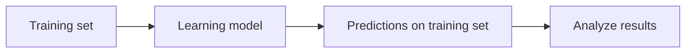
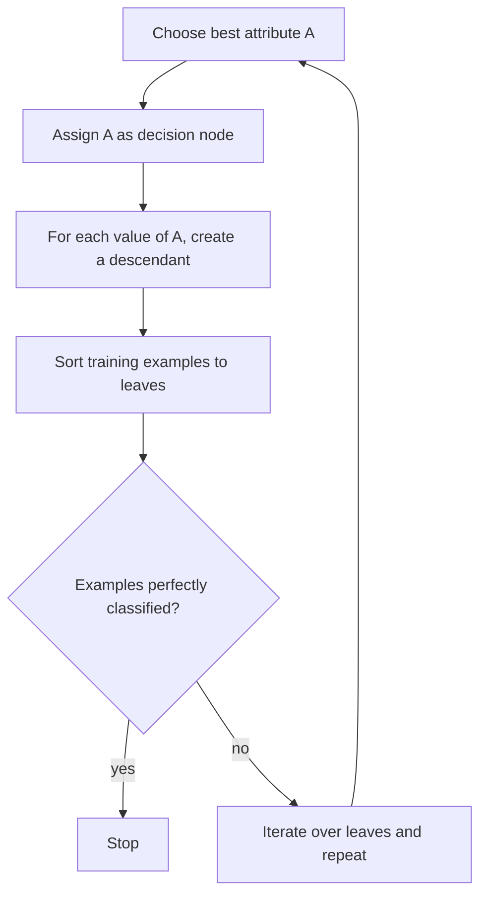
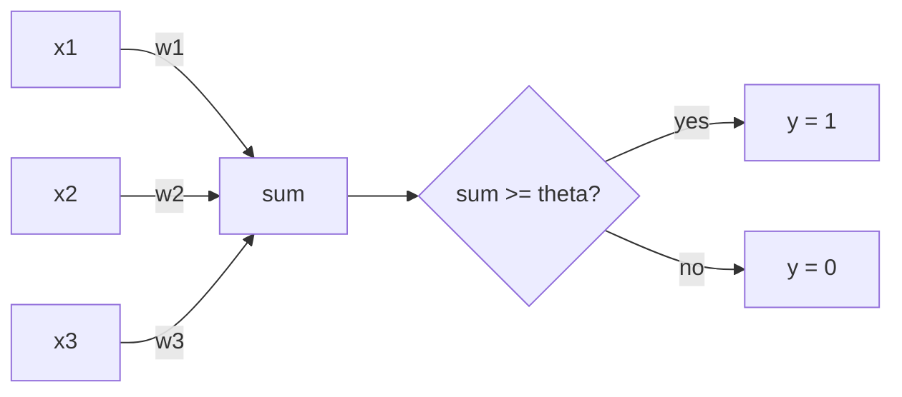
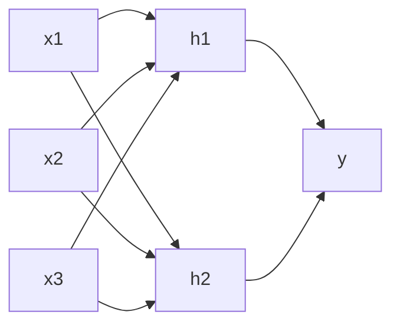
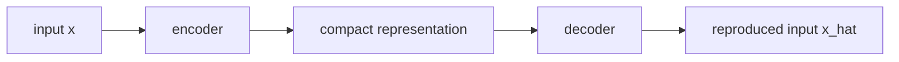
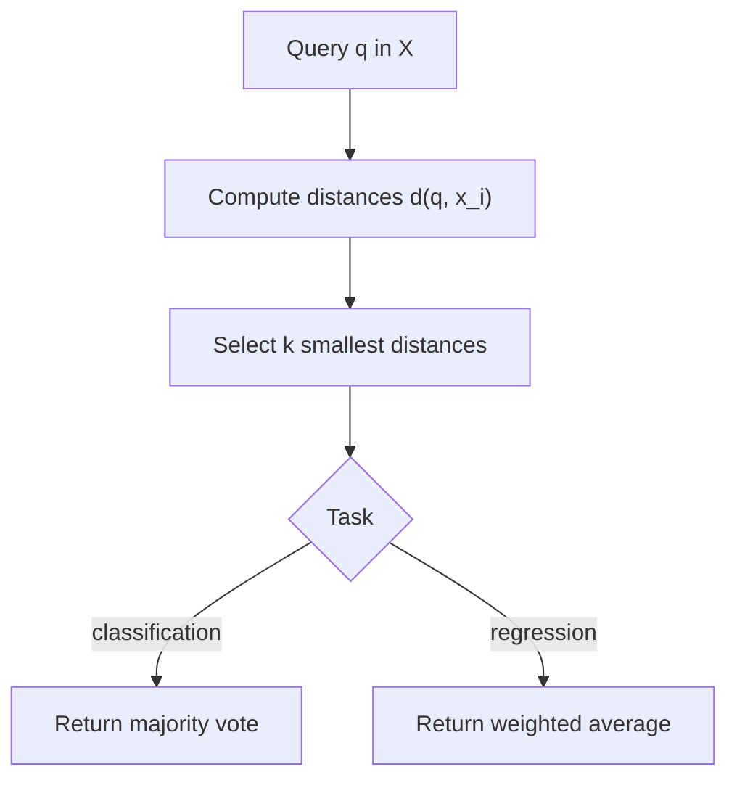
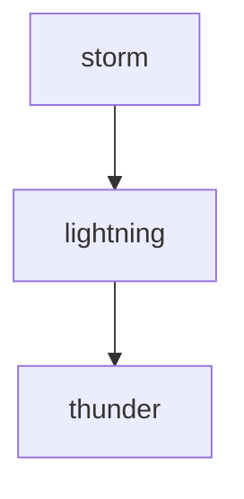
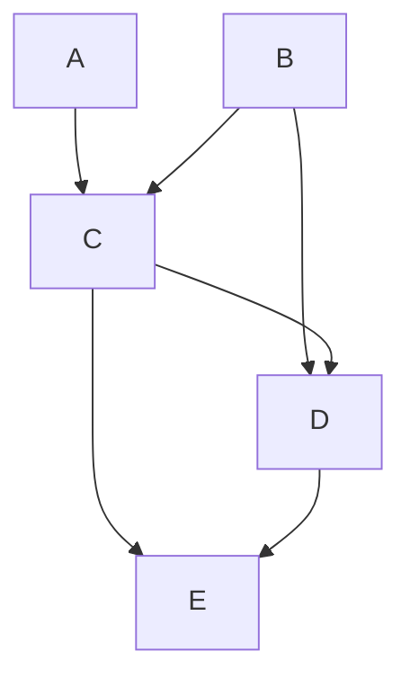
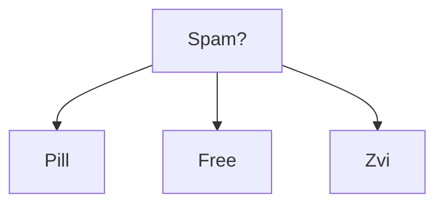
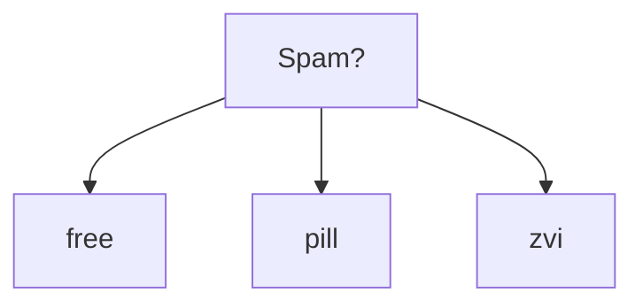

These are OCR-assisted transcriptions of handwritten CS 4641
machine learning notes. The scan metadata is from 2026, but
the dates visible in the notes begin on `2016/05/25`; later
pages show `2016/05/26`, `2016/05/31`, `2016/06/02`, and
`2016/06/09`. One page appears to show `2016/05/24`, but the
first numbered page in this packet is dated `2016/05/25`.

I kept the page images next to the transcription so the
original notation remains inspectable. When the handwriting
was not reliable, I marked the text with `[unclear]`.

## Page 1: Decision Trees


Date read from the page: `2016/05/25`.

The notes open with three classes of machine learning
problems:

- supervised learning: a set of data and labels allows an
  inductive bias;
- unsupervised learning: description, summarization, and
  deciding what to summarize or split on;
- reinforcement learning: learn from delayed reward, such as
  deciding whether a tic-tac-toe game was good at each step
  or only at the end.

Supervised learning is divided into classification and
regression. Classification separates instances into classes.
Regression predicts a continuous output, e.g. `y = mx + b`.

The simple ML pipeline is:



A decision tree is represented as:

- circles: nodes or attributes;
- edges: values;
- squares/leaves: decisions or outputs.

For a restaurant example, the input is the feature vector
for a restaurant instance and the output is something like
`yes`, `no`, or `enter`.

Construction algorithm:

1. Pick the best attribute.
2. Ask the question.
3. Follow the path.
4. Go to 1 until an answer is reached.

Decision trees can express Boolean functions. The notes
sketch trees for `A AND B`, `A OR B`, and `A XOR B`. XOR
requires a fuller tree.

```text
A AND B

        A
      T/ \F
      B   F
    T/ \F
    T   F

A OR B

        A
      T/ \F
      T   B
        T/ \F
        T   F

A XOR B

        A
      T/ \F
      B   B
    T/ \F T/ \F
    F   T T   F
```

For `n`-XOR, the note says the tree is exponential:
`O(2^n)`. The total number of Boolean outputs is written as
`O(2^(2^n))`.

## Page 2: ID3 And Entropy


The decision-tree learner is labeled
`ID3: Iterative Dichotomizer 3`. The loop is:



The best attribute selection is written as information gain:

$$
Gain(S, A) = Entropy(S) -
\sum_v \frac{|S_v|}{|S|} Entropy(S_v)
$$

Here `S` is the training set and `A` is the current
attribute. Entropy is noted as a measure of randomness:

$$
Entropy(S) = - \sum_v p(v) \log p(v)
$$

For continuous attributes, the notes say to look at data to
get ranges, e.g. split on `20 <= age <= 30`. The notes ask
whether attributes can repeat along a path; for continuous
attributes, the answer is yes.

Stopping and overfitting notes:

- noise can cause an infinite loop;
- prune leaves;
- remove nodes that overfit to noise and employ a voting
  mechanism;
- vote over leaves.

ID3 bias:

- restriction bias: the hypothesis space is discrete
  functions;
- preference bias: choose a hypothesis in the space, prefer
  good splits near the top, prefer correct over incorrect,
  prefer shorter trees.

For regression, the note says information gain is not
directly usable; consider variance and output averages
instead.

## Page 3: Perceptrons And Neural Networks


Date read from the page: `2016/05/25`.

An artificial neuron is introduced as a perceptron:



The rule is:

$$
if \sum_{i=1}^{k} x_i w_i \geq \theta,\quad y = 1;
\quad else,\quad y = 0
$$

The page asks: how powerful is a perceptron? With weights
and thresholds, a linear classifier can express `AND`, `OR`,
and `NOT`:

```text
Function    w1     w2     theta
AND         1/2    1/2    3/4
OR          1/2    1/2    1/4
NOT        -1      --     0
```

A single perceptron cannot represent XOR:

```text
x1  x2  XOR
1   1   F
1   0   T
0   1   T
0   0   F
```

The note says perceptrons can express `AND`, `OR`, and
`NOT`, so a network of perceptrons can represent Boolean
functions. The warning is that, with enough nodes, there is
danger of overfitting.

Restriction bias:

- perceptron: linear planes;
- sigmoid neural network: much less restriction;
- Boolean: network of perceptrons;
- continuous: connected neurons with one hidden layer;
- arbitrary: stitch together with two hidden layers, minimum
  `[unclear]`.

Preference bias depends on the algorithm and initial
weights: small random weights, low complexity, and local
minima. Neural networks are hard to understand and
parameters are hard to tune, but they are useful when the
representation problem is complex.

## Page 4: Perceptron Training And Gradient Descent


The perceptron training data is:

$$
D = \{(x^{(n)}, y^{(n)})\}_{n=1}^{N}
$$

where `y` is the target/label, `x` is the input, and the
model output is either `1` or `0`.

The perceptron rule is written using a thresholded
prediction `hat{y}`:

$$
\hat{y}^{(n)} =
\left(\sum_i w_i x_i^{(n)} \geq \theta\right)
$$

The note rewrites the threshold as a bias term by setting
`x_0 = 1` and `w_0 = -theta`:

$$
\hat{y}^{(n)} =
\left(\sum_{i=0}^{d} w_i x_i^{(n)} \geq 0\right)
$$

Update rule:

$$
w_i' = w_i + \Delta w_i,\quad
\Delta w_i = \eta (y^{(n)} - \hat{y}^{(n)}) x_i
$$

The algorithm repeats while error is greater than zero:

1. update weights;
2. recompute the prediction;
3. correct the sign/direction of `w_i` depending on whether
   the model under- or over-predicted.

The theorem is stated: if the data is linearly separable,
then the perceptron rule will find the separating plane in a
finite number of steps.

If the data is not linearly separable, the page introduces
gradient descent:

$$
a = \sum_i x_i w_i
$$

Perceptron output is thresholded, while gradient descent
uses a non-thresholded output and minimizes:

$$
E(w) = \frac{1}{2}\sum_{x,y}(y-a)^2
$$

The derived update is:

$$
w_i = w_i - \eta \frac{\partial E}{\partial w_i}
    = w_i + \Delta w_i
$$

## Page 5: Comparing Learning Rules


The page asks why gradient descent works. If the error slope
at `w_1` is positive, move weights down; if the slope at
`w_2` is negative, move weights up. The notes then compare
perceptron learning and gradient descent:

$$
\Delta w_i = \eta (y - \hat{y})x_i
$$

$$
\Delta w_i = \eta (y - a)x_i
$$

The page states:

- perceptron rule: finite convergence;
- gradient descent: robust to non-linearly separable data.

The thresholded output is not differentiable:

```text
hard threshold

 output
   1 |      ______
     |     |
   0 |_____|
          a
```

The fix is a soft threshold, such as a sigmoid:

$$
\hat{y} = \sigma(a) = \frac{1}{1 + e^{-a}}
$$

As `a -> -infinity`, `sigma(a) -> 0`; as `a -> +infinity`,
`sigma(a) -> 1`. The derivative is written:

$$
\sigma(a)(1-\sigma(a))
$$

The neural-network note is that differentiability lets us
figure out the effect of all weights on the output.
Backpropagation efficiently computes all partial
derivatives, so any differentiable function can be used. The
page also warns that gradient descent can get stuck in local
optima; more nodes and larger weights increase complexity
and overfitting risk.

## Page 6: Feedforward Networks, Recurrent Networks, Autoencoders


Date read from the page: `[2016/05/24?]`.

The page contrasts perceptrons and sigmoid neural networks.
A feedforward neural network is drawn as input nodes, hidden
nodes, and a single output:



The note says this works when there is a lot of data and
time to train.

Recurrent neural networks are drawn as a unit with feedback,
then "unfolded" across time. The note says this allows
modeling of varying-sized data, like sentences.

Autoencoders are drawn as a network that reproduces its
input:



The loss is written as a reconstruction loss:

$$
\sum_{n=1}^{N} L(x^{(n)}, \hat{x}^{(n)})
\propto
\sum_{n=1}^{N} (x^{(n)} - \hat{x}^{(n)})^2
$$

The note says the loss is minimized when
`x^(n) = x_hat^(n)`, and that an autoencoder can find a more
compact representation of the inputs.

## Page 7: Support Vector Machines


The SVM section starts by asking which separating line is
right. The training data is incomplete, so the model must be
flexible for new data and avoid overfitting.

Goal:

1. find a plane that maximizes the margin;
2. classify all points correctly.

Assumption: the data is linearly separable.

The separating plane is:

$$
w^T x + b = 0
$$

with margin boundaries:

$$
w^T x + b = 1
$$

and

$$
w^T x + b = -1
$$

The circled points on the margin are labeled "support
vectors".

```text
       + + +
          /
---------/---------  w^T x + b = 1
        /
-------/-----------  w^T x + b = 0
      /
-----/-------------  w^T x + b = -1
   - -

margin = distance between the support planes
```

The line equation is generalized:

$$
y = mx + d
$$

$$
a x + c y = d
$$

and in more dimensions:

$$
w_1x_1 + w_2x_2 + \cdots + w_nx_n + b = 0
$$

The goal becomes: find a plane `w^T x + b = 0` satisfying
the classification and margin constraints.

## Page 8: SVM Optimization, Soft Margins, Kernels


The distance from a point to the plane is derived as:

$$
dist(x^{(n)}, w^T x + b = 0) = \frac{1}{||w||}
$$

given the scaling condition:

$$
|w^T x^{(n)} + b| = 1
$$

The optimization is:

$$
y^{(n)}(w^T x^{(n)} + b) \geq 1
$$

which is noted as solvable with a quadratic programming
problem. In the dual form, the page writes weights as:

$$
w = \sum_{n=1}^{N}\alpha^{(n)} y^{(n)} x^{(n)}
$$

The notes say most `alpha` values are zero; only the margin
points matter. These are the support vectors.

For non-linearly separable data, the page introduces a
soft-margin SVM:

$$
y^{(n)}(w^T x^{(n)} + b) \geq 1 - \xi^{(n)}
$$

and minimization:

$$
\frac{1}{2}||w||^2 + C\sum_{n=1}^{N}\xi^{(n)}
$$

If the data is too non-linearly separable, try mapping to a
higher-dimensional space. The sketch says to "pull out" the
center and cut off segments in 3D with a linear classifier.

## Page 9: Kernel Trick And Instance-Based Learning


The kernel section transforms `x` into 3D:

$$
\Phi(p) = (p_1^2, p_2^2, \sqrt{2}p_1p_2)
$$

The dot product in transformed space becomes:

$$
\Phi(p)^T\Phi(q) = (p^Tq)^2
$$

This is labeled a polynomial kernel. The page also mentions
an exponential/RBF-style kernel:

$$
e^{-||p-q||^2 / 2\sigma^2}
$$

The note says this simulates a kernel in
infinite-dimensional space because it is expandable with a
Taylor series, while still using a linear classifier.

Bias notes:

- minimize misclassification from generalization error;
- preference bias is maximum margin;
- restriction bias is open to the kernel used.

Instance-based learning is introduced as fitting only the
training data. A lookup table can return the exact training
output but gives the wrong answer away from stored
instances.

For `k`-nearest neighbors:



The notes define the model as looking at the `k` nearest
neighbors and using a voting mechanism. Given:

$$
D = \{(x^{(n)}, y^{(n)})\}_{n=1}^{N}
$$

with distance `d(x^(n), x^(m))`, choose `K` neighbors and
classify by vote or regress by weighted average.

## Page 10: Domain Knowledge, k-NN, Bagging


Domain knowledge appears as choices of distance and `k`,
with cross-validation used to choose `k`. The page notes
k-NN is used in spiral sets.

Bias:

- preference bias: locality depends on distance;
- features matter equally, as reflected in the neighbor
  distance.

Curse of dimensionality:

- to fill the same amount of space in higher dimensions,
  accuracy decreases;
- autoencoders can help;
- dimension equals features;
- dimensions must be chosen properly.

k-NN notes:

- `k = NN`: nearest neighbors;
- `k = N`: all data points;
- using mean learns nothing;
- weighted mean/average can be used;
- very easy to incorporate domain knowledge by defining the
  distance function;
- very fast for small datasets;
- easy to implement;
- lazy learner;
- lazy learning means the model is learned when
  classification is requested;
- very time consuming with large datasets.

Ensemble learning combines multiple learners. The note names
bagging and boosting. Simple rules do not work on large
datasets, so the framework is:

1. learn simple rules over small subsets of data;
2. combine them.

## Page 11: Bagging And Boosting


Bagging framework:

1. pick uniformly random elements;
2. average them.

The example is fitting third-order polynomials on random
subsets, then averaging the curves. This reduces overfitting
by averaging.

Bagging is "aggregate bagging" and helps reduce overfitting.
It assumes an unweighted average. The note sketches the
zero-order polynomial case as a horizontal average across
`N` disjoint sets.

Boosting combines simpler learners and "boosts" performance:

1. learn over subsets, especially the hardest examples;
2. combine by a mean or weighted mean.

The hardest-example determination involves error:

$$
error = \#misclassifications
$$

The learner's weight is related to how often it occurs or
how well it performs. Weak learners classify better than
random chance:

$$
P[h(x) \neq c(x)] \leq \frac{1}{2} - \epsilon
$$

The page includes a small table of hypotheses `h1`, `h2`,
and `h3` over examples `x1` through `x4`, and a second table
that splits examples into "good" and "bad" proportions.

## Page 12: AdaBoost


AdaBoost is described as weak-learner agnostic and able to
use any learner.

Given:

$$
D = \{(x^{(n)}, y^{(n)})\}_{n=1}^{N},\quad
y^{(n)} \in \{-1, +1\}
$$

For `t = 1, ..., T`:

1. construct distribution `D_t`;
2. find a weak classifier `h_t(x)` with small error;
3. output:

$$
H_{final}(x) = sign\left(\sum_t \alpha_t h_t(x)\right)
$$

The error is:

$$
\epsilon_t = P_{D_t}[h_t(x) \neq c(x)]
$$

The sketch shows decision stumps: axis-aligned thresholds
are selected to minimize error. If a point is on the correct
side, reduce its weight; otherwise increase its weight.

The weight update is written in the form:

$$
D_{t+1}(n) =
\frac{D_t(n)e^{-\alpha_t y^{(n)}h_t(x^{(n)})}}{Z_t}
$$

with normalization `Z_t`. The note says:

$$
\alpha_t = \frac{1}{2}\ln\frac{1-\epsilon_t}{\epsilon_t}
$$

The overfitting sketch compares training error and
cross-validation error. AdaBoost can keep reducing training
error, while the relevant curve is cross-validation error.

## Page 13: Regression And Linear Algebra


Date read from the page: `2016/05/31`.

The page starts with a recap of AdaBoost:

- combine weak learners;
- agnostic learning;
- connection to max-margin;
- cross-validation error is a simulation of testing error.

Regression deals with continuous outputs.

Linear regression:

$$
\hat{y} = mx + b = w^T x = w_0x_0 + w_1x
$$

Polynomial regression:

$$
\hat{y} = w_0x_0 + w_1x_1 + w_2x_2^2 + w_3x_3^3 + \cdots = w^Tx
$$

The order is chosen using cross-validation.

The page asks how to fit the model and lists:

1. linear algebra;
2. calculus;
3. bias-variance decomposition.

For linear algebra, set `x_0 = 1`. In matrix form:

$$
Xw = \hat{Y} \approx Y
$$

with an error vector:

$$
Xw = Y + \epsilon
$$

Multiplying by `X^T` gives:

$$
X^TXw = X^TY
$$

and therefore:

$$
w = (X^TX)^{-1}X^TY
$$

The note says this is bad when the dimension of `X` is large
because the inverse is expensive: `O(N^3)`.

## Page 14: Regression, SGD, Bias-Variance


The calculus method uses:

$$
Error(w) = \frac{1}{2}\sum_{n=1}^{N}(y^{(n)} - \hat{y}^{(n)})^2
$$

and:

$$
\frac{\partial Error}{\partial w_j}
=
\sum_{n=1}^{N}(y^{(n)} - \hat{y}^{(n)})(-x_j^{(n)})
$$

Batch gradient descent:

$$
w_j := w_j - \eta \frac{\partial Error}{\partial w_j}
$$

It requires full recomputation.

Stochastic gradient descent is usable with online learning:

$$
\frac{\partial Error^{(n)}}{\partial w_j}
=
(y^{(n)} - \hat{y}^{(n)})(-x_j^{(n)})
$$

and updates from a single data point. Mini-batch gradient
descent compiles a batch and then adjusts the model.

The notes say gradient descent requires precise setting of
the learning parameter `eta`; linear algebra does not need
`eta`.

Bias-variance decomposition:

$$
y^{(n)} = w^{*T}x^{(n)} + \epsilon^{(n)}
$$

The model is `w_hat`; the real model is `w*`.

$$
MSE(\hat{w}) =
Var(\hat{w}) + (E(\hat{w}) - w^*)^2
$$

Variance is error from small fluctuations in the data. High
variance leads to overfitting. Bias is error from
assumptions of the model. High bias leads to underfitting.
The notes say increasing bias a little can decrease variance
a lot, lowering expected error; the human brain prefers high
bias and low variance.

## Page 15: Information Theory


The information-theory page asks:

How much information does `y` get from `x_0, x_1, x_2`?

The element of surprise is illustrated with fair and biased
coins. Entropy is the minimum number of yes/no questions.

The notes compare message encodings:

```text
Case 1: four equally likely events

A 25% -> 00
B 25% -> 01
C 25% -> 10
D 25% -> 11

Expected message size = 2 bits

Case 2: one common event

A 50.0% -> 0
B 12.5% -> 110
C 12.5% -> 111
D 12.5% -> 10

Expected message size = 1.75 bits
```

Information properties:

$$
I(p) \geq 0
$$

$$
I(1) = 0
$$

For independent events:

$$
I(p_1p_2) = I(p_1) + I(p_2)
$$

The information of an event is:

$$
I(p) = \log \frac{1}{p}
$$

Total information is:

$$
\sum_i p_i \log \frac{1}{p_i}
=
-\sum_i p_i \log p_i
= Entropy
$$

The page notes: in ML, entropy is a measure of randomness
and uncertainty.

## Page 16: Entropy, Mutual Information, KL Divergence


Entropy:

$$
H(X) = -\sum_{x \in X} p(x)\log p(x)
$$

Joint entropy:

$$
H(X,Y) = -\sum_x\sum_y p(x,y)\log p(x,y)
$$

Conditional entropy:

$$
H(Y|X) = -\sum_x\sum_y p(x,y)\log p(Y|X)
$$

If `X` and `Y` are independent, then `H(Y|X) = H(Y)`.

Mutual information is the reduction in uncertainty of `Y`
when knowledge of `X` is known. The page points out this is
found in the decision-tree information gain:

$$
I(X,Y) = H(Y) - H(Y|X)
$$

Relative entropy:

$$
D(p||q) = \sum_x p(x)\log\frac{p(x)}{q(x)}
$$

This is labeled KL divergence and described as the
difference between two distributions.

The page has a short biology note: evolution is a non-random
process involving random mutations. The phrase "max-margin
property" appears at the bottom.

## Page 17: Computational Learning Theory


Date read from the page: `2016/06/02`.

The central question is: how much data is needed to
successfully learn?

Two costs are named:

- computational cost: time and space to learn;
- sample complexity: amount of data needed.

Version spaces:

- true hypothesis: `c in H`;
- candidate hypothesis: `h in H`;
- training data: `S subset X`, pairs;
- `c(x)` for all `x in S`.

A consistent learner satisfies:

$$
h(x) = c(x)\quad \forall x \in S
$$

The version space is:

$$
VS(S) = \{h \mid h \in H,\ h\ consistent\ with\ S\}
$$

The example uses two Boolean features:

```text
Training data:

x1  x2  h(x)
0   0   0
1   0   1

Target concept c(x):

x1  x2  c(x)
0   0   0
0   1   1
1   0   1
1   1   0
```

The notes list a hypothesis set with `x1`, `not x1`, `x2`,
`not x2`, `T`, `F`, `OR`, `AND`, `XOR`, and `EQUIV`. The
version space for the partial training set is written as
`{x1, OR, XOR}`.

Training error is the fraction of training examples
misclassified by `h`. True error is the fraction of examples
that would be misclassified on a sample from the
distribution:

$$
error = Pr_{x \sim D}[h(x) \neq c(x)]
$$

The page defines symbols:

- `C`: concept goal;
- `L`: learner;
- `H`: hypothesis space;
- `D`: distribution over `X`;
- `0 <= epsilon <= 1/2`: error goal;
- `0 <= delta <= 1/2`: uncertainty goal.

## Page 18: PAC Learning And Haussler Bound


PAC means probably approximately correct. A concept `C` is
PAC-learnable by learner `L` over hypothesis space `H` if,
with probability at least `1 - delta`, the learner outputs
`h in H` where `error(h) <= epsilon`, in time and space
polynomial in:

$$
\frac{1}{\epsilon},\quad \frac{1}{\delta},\quad |H|
$$

`epsilon`-exhausted:

$$
VS(S)\ is\ \epsilon\text{-exhausted}
$$

if every `h in VS(S)` has error less than or equal to
`epsilon`.

Haussler theorem notes:

- bound the true error for a concept class;
- cut down the version space until it is
  `epsilon`-exhausted;
- for a finite hypothesis class:

$$
m \geq \frac{1}{\epsilon}
\left(\ln |H| + \ln\frac{1}{\delta}\right)
$$

The page asks what happens when `|H| = infinity`. Examples
of infinite hypothesis spaces include:

- linear hyperplanes;
- decision trees with continuous attributes;
- artificial neural networks with weights in `R`.

The note says the finite bound does not work exactly when
`H` is infinite, such as linear regression where the set of
lines is infinite.

## Page 19: VC Dimension


The notes define VC dimension as:

> What is the largest set of inputs that the hypothesis
> class can label correctly in all possible ways?

It is marked as equivalent to "shatter" and related to true
parameters.

For `X in R`, intervals have examples:

- VC >= 1: yes;
- VC >= 2: yes;
- VC >= 3: `[unclear sketch]`.

For a decision tree with discrete structure:

- syntactically infinite;
- semantically finite.

Example:

$$
X = \{1,2,3,4,5\}
$$

and a threshold hypothesis class:

$$
H = \{h(x) = (x \geq \theta)\},\quad \theta \in N
$$

There are redundant syntactic trees or thresholds because
different syntactic choices can have the same semantic
labeling on the finite domain.

## Page 20: VC Dimension Of Linear Separators


For linear separators in `R^2`:

$$
H = \{h(x) = (w^Tx > 0)\}
$$

The page states:

```text
VC >= 1?  Yes
VC >= 2?  Yes
VC >= 3?  Yes
VC >= 4?  No
```

So the linear separator VC dimension is `3`. More generally:

```text
Dimension D     VC dimension
interval        2
2D              3
3D              4
...
d               d + 1
```

Sample-complexity notes:

For finite `H`:

$$
m \geq \frac{1}{\epsilon}
\left(\ln |H| + \ln\frac{1}{\delta}\right)
$$

For infinite `H`, the bound uses VC dimension:

$$
m \geq
\frac{1}{\epsilon}
\left(8 VC(H)\log_2\frac{13}{\epsilon}
+4\log_2\frac{2}{\delta}\right)
$$

Example: for `X in R^2`, the class of convex polygons that
return true when `x` is inside or on the polygon has
infinite VC dimension, because all points can be shattered.
The page also asks about the VC dimension for circles
centered at the origin.

## Page 21: Bayesian Learning


The page bridges computational learning theory to Bayesian
learning:

$$
H\ is\ PAC\text{-}learnable \iff VC(H)\ is\ finite
$$

Bayes theorem is introduced through Thomas Bayes and Richard
Price:

$$
P(B|A) = \frac{P(A|B)P(B)}{P(A)}
$$

Bayesian learning:

> Learn the best hypothesis given data and domain knowledge.

The best hypothesis is the most probable one:

$$
\hat{h} = argmax_h P(h|D)
$$

and:

$$
P(h|D) =
\frac{P(D|h)P(h)}{P(D)}
$$

The terms are labeled:

- `P(D|h)`: data given hypothesis;
- `P(h)`: prior knowledge over `h`, induction bias;
- `P(D)`: prior on data.

The page has a disease-test example:

- prior: `P(X) = 0.008`;
- test returns correct positive: `98%`;
- test returns correct negative: `97%`.

The important marginal/probability note says: priors matter.

## Page 22: MAP, Maximum Likelihood, Least Squares


For each `h in H`, calculate:

$$
P(h|D) \propto P(D|h)P(h)
$$

because `P(D)` is ignored as a constant when maximizing.

Maximum a posteriori:

$$
\hat{h}_{MAP} = argmax_h P(h|D)
$$

Maximum likelihood:

$$
\hat{h}_{ML} = argmax_h P(D|h)
$$

Example data:

$$
D = \{x^{(n)}, y^{(n)}\}_{n=1}^{N}
$$

with:

$$
y^{(n)} = f(x^{(n)}) + \epsilon^{(n)}
$$

and Gaussian independent noise:

$$
\epsilon^{(n)} \sim N(0,\sigma^2)
$$

The derivation shows that maximum likelihood under Gaussian
noise leads to least squares:

$$
\hat{h}_{ML}
= argmin_h \sum_{n=1}^{N}(y^{(n)} - h(x^{(n)}))^2
$$

The page notes this recovers the least-squares result from
the linear algebra section.

## Page 23: MDL And Bayes-Optimal Classification


The top of the page connects MAP to minimum description
length:

$$
\hat{h}_{MAP} = argmax_h P(D|h)P(h)
$$

and then:

$$
argmin_h\ -\log_2 P(D|h) - \log_2 P(h)
$$

Interpretation:

- `-\log_2 P(D|h)`: length of `h` fitting the data, or the
  measure of errors made;
- `-\log_2 P(h)`: size of `h`, which prefers smaller models
  and acts as inductive bias;
- minimize both error and size of `h`.

The note says that for information theory, an event with
probability `p` has length about `-log p`.

For artificial neural networks, as the weights grow, the
number of bits grows, so the size of `h` grows.

Bayesian classification example:

```text
h(x)   label   P(h | D)
h1       +       0.4
h2       -       0.3
h3       -       0.3
```

The best hypothesis is `h1`, but the best label is `-`
because the negative hypotheses have total posterior mass
`0.6`.

Best label:

$$
argmax_{y_j} P(y_j|D)
=
argmax_{y_j}\sum_{h \in H}P(y_j|h)P(h|D)
$$

Bayes-optimal classifier note:

> No other learner using the same `H` and the same prior
> knowledge can outperform this method on average.

## Page 24: Joint Probability And Belief Networks


Joint probability table:

```text
Storm  Lightning  P(S,L)
T      T           0.25
T      F           0.40
F      T           0.05
F      F           0.30
```

Marginalization:

$$
P(\neg S) = \sum_{v \in L}P(\neg S, v) = 0.35
$$

Conditional probability:

$$
P(L|S) = \frac{P(L,S)}{P(S)} = \frac{0.25}{1-0.35}
$$

Three-variable table:

```text
Storm  Lightning  Thunder  P(S,L,Th)
T      T          T        0.20
T      F          T        0.04
F      T          T        0.04
T      T          F        0.05
F      T          F        0.01
```

Independence:

$$
A \perp B \iff P(A|B)=P(A)
$$

Conditional independence:

`X` is conditionally independent of `Y` given `Z` if:

$$
P(X=x|Y=y,Z=z) = P(X=x|Z=z)
$$

The belief network for weather is:



with terms such as `P(s)`, `P(l|s)`, `P(l|not s)`,
`P(th|l)`, and `P(th|not l)`.

## Page 25: Directed Graphical Models And Naive Bayes


The page gives a directed acyclic graph:



The note says the graph can form generative models. Sample
in order:

```text
a ~ P(A)
b ~ P(B)
c ~ P(C | A, B)
d ~ P(D | B, C)
e ~ P(E | C, D)
```

The joint distribution factorizes as:

$$
P(A,B,C,D,E)=P(A)P(B)P(C|A,B)P(D|B,C)P(E|C,D)
$$

The page notes `D` is conditionally independent of `A` given
`B` and `C`.

Inference example:

```text
box 1: G G
       G Y

box 2: B B
       B G
```

Process:

1. pick box uniformly;
2. draw ball 1 without replacement;
3. draw ball 2.

The inference line computes:

$$
P(ball2 = B | ball1 = G)
=
\sum_{box}P(ball2 = B, box | ball1 = G)
$$

At the bottom, spam classification is represented as a Naive
Bayes network:



Assumption: all attributes are independent given the label.
This is the "naive" assumption in Naive Bayes.

## Page 26: Naive Bayes


Date read from the page: `2016/06/09`.

Naive Bayes is written as a belief network:



The assumption is:

> "free" is independent of "pill" given spam.

Example table:

```text
Pill  Free  Zvi  Spam?
T     T     T    F
T     T     F    T
T     F     T    T
```

Assume attributes are conditionally independent given
`Spam?`.

The scoring equation is:

$$
P(spam? | pill,\neg free,\neg zvi)
\propto
P(pill,\neg free,\neg zvi | spam?)P(spam?)
$$

and by the Naive Bayes assumption:

$$
P(pill|spam?)P(\neg free|spam?)P(\neg zvi|spam?)P(spam?)
$$

The maximum a posteriori classifier is:

$$
y_{MAP}
=
argmax_{y_j} P(y_j)\prod_{i=1}^{k}P(a_i|y_j)
$$

The page notes `N` is a count function:

$$
P(y_j) = \frac{count(y_j)}{total}
$$

and:

$$
P(a_i|y_j)=\frac{N(a_i,y_j)}{N(y_j)}
$$

Benefits:

- few attributes;
- tractable;
- generative;
- can generate examples of spam emails;
- a way to visualize data;
- used by Google.

Downside:

- strong conditional-independence assumption.

## Diagram Notes

Mermaid is already vendored by this site through
`/static/mermaid-v11.14.0/mermaid.css` and
`/static/mermaid-v11.14.0/mermaid.min.js`, and initialized
by `/static/js/main.js`. The diagrams above reuse that local
integration.
