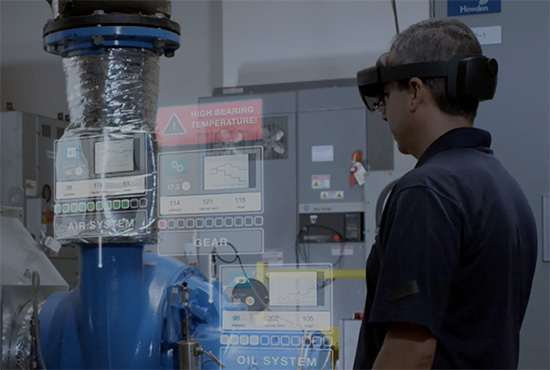
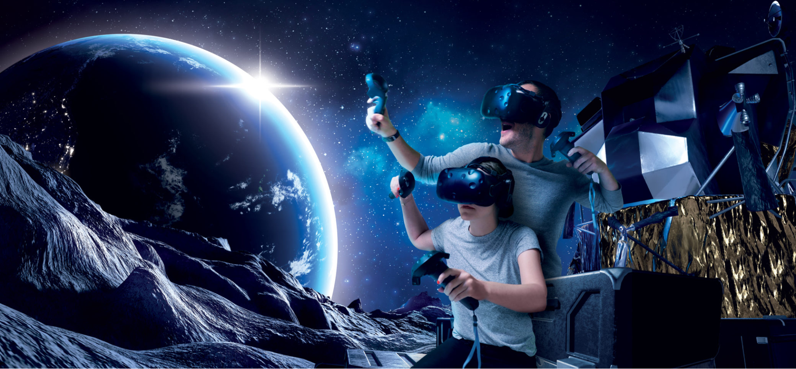
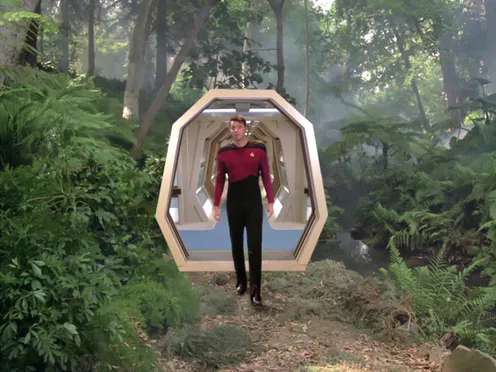
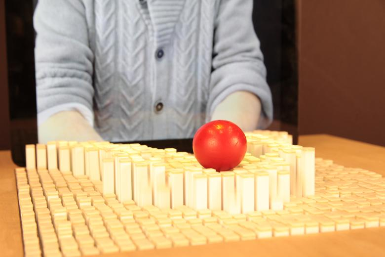

**Note:** This is currently a "brain dump" of information I've collected in the past few years. It's very rough, but I hope someone somewhere can find value from it and perhaps contribute! :)

---

> *We are cyborgs, and forever will be cyborgs.*  
> Pattie Maes

---

# Glossary

<table class="table table-striped">
   <thead>
      <tr>
         <th>Acronym</th>
         <th>Term</th>
         <th>Acronym</th>
      </tr>
   </thead>
   <tbody>
      <tr>
         <td>AI</td>
         <td>Artifical Intelligence</td>
         <td>The field of creating computer agents comparable to humans in a variety of discrete tasks ranging from image classification to automobile driving.</td>
      </tr>
      <tr>
         <td>API</td>
         <td>Application programmers interface</td>
         <td> </td>
      </tr>
      <tr>
         <td>AR</td>
         <td>Augmented Reality</td>
         <td> </td>
      </tr>
      <tr>
         <td>HCD</td>
         <td>Human-Centered Design</td>
         <td> </td>
      </tr>
      <tr>
         <td>HCI</td>
         <td>Human-Computer Interaction</td>
         <td> </td>
      </tr>
      <tr>
         <td>HWD</td>
         <td>Head-Worn Display</td>
         <td>Describes any display mounted on the head with information presented to the eyes and ears through a display and speakers, respectively.</td>
      </tr>
      <tr>
         <td>HUD</td>
         <td>Heads-up Display</td>
         <td>A subset of HWDs that details</td>
      </tr>
      <tr>
         <td>VR</td>
         <td>Virtual Reality</td>
         <td></td>
      </tr>
   </tbody>
</table>

---

# Introduction

We are currently experiencing the convergence of multiple scientific trends that will enable us humans will gain full control over evolution:

1. CRISPR allows us humans to modify our own DNA, 
2. The internet augments the human memory to the entire sum of human memory,
3. AI will allow humans to process inordinate amounts of information thus increasing the scope of our intuition,
4. AR allows humans to foundationally improve our field of visual perception and the amount of useful information we can ingest.

For the first time in our six million year history (since diverging from our nearest living evolutionary), we will soon be able to control our genetics and augment the cortex that allowed us to become the dominant creatures on Earth.

Symbiotic AI expresses the principle that machine agents and human agents can compensate each others' deficiencies and augment each others' strengths: Humans have excellent intuition and terrible memory, both honed by millions of years of evolution. Computers have perfect memory and terrible intuition, both being developed rapidly by increasing computing power although AI is still far from it's telos of General Intelligence.

Human-machine symbiosis can take many forms:

1. a 12 year old spending the entire day with her smartphone being able to research any fact from all of human knowledge after just a few taps, or
2. a student using a Remembrance Agent [[Rhodes 1997]](https://www.google.com/url?q=https://paperpile.com/c/mpEskP/0nl3&amp;sa=D&amp;ust=1586417454230000) to automatically pull up meeting notes with every person he's ever met, or
3. a "Borg" like creature (see Star Trek: Voyager) merging human and metal into one being inseparable from each other.

Seven of Nine from Star Trek: Voyager [[Fleenor 2019]](https://www.google.com/url?q=https://paperpile.com/c/mpEskP/cNpY&amp;sa=D&amp;ust=1586417454233000)

In this text, we primarily investigate non-invasive forms of human augmentation that offers many benefits (explored in depth later) including:

1. The option of "turning off" the system and removing augmentations with ease,
2. General accessibility.

These technologies take the form of wearable computers seen in form factors like watches, HWDs, smartphones, or brain-machine EEG "skull" caps. AR will be investigated as the primary "bridge" between humans and machines, although non-visual alternatives will be explored in depth later.

---

# Human-Machine Symbiosis

## Closing the loop between intention and action

Say I want to buy a new car. Which path is easier for me?

Buying a car from a dealership

1. I put on shoes,
2. I go to my existing car (or call a friend to give me a ride)
3. I go to a dealership
4. I look at the available cars,
5. I talk to the dealer to buy the car,
6. I negotiate a price with the dealer,
7. I talk through all the additional details,
8. I pay for the car,
9. I drive away with my new car on that day.

Buying a car online.

1. I grab my laptop,
2. I go to tesla.com,
3. I find the car I want,
4. I read about and configure all my extras,
5. I pay for the car,
6. I have the car delivered to me within a week.

My intention is the same. However, the two action paths are different: One is rather time and labor intensive (I have to put on shoes!) and the other I can do from my bed. This is the whole premise behind online shopping, more specifically Amazon's patented 1-Click [[Hartman et al. 1999]](https://www.google.com/url?q=https://paperpile.com/c/mpEskP/jiKd&amp;sa=D&amp;ust=1586417454237000). By reducing the time between intention and action habit can be formed. Once a habit is formed, it's ingrained, it's useful, and it's profitable (for those of that persuasion).

The distance between action and intent: It's a key concept for the melding of men and machines, humans and AI. Reduce the overhead of a communication bridge or the time to act on a thought and habits are formed, we get closer to our goals and the machine gets closer to us.

## Notes from Pattie Maes: "Human-Machine Symbiosis"

[[Maes 1997]](https://www.google.com/url?q=https://paperpile.com/c/mpEskP/se69&amp;sa=D&amp;ust=1586417454238000) observes that we've experienced a revolution in computing in the past 30 years: our bodies have been augmented in a significant and permanent way; the two "halves" of our brains are no longer the "left" or "right" but instead the biological we are given and the digital we use to voluntarily augment our memory and communication.

The interface between our biological and digital worlds is currently limited to smartphones and laptops. These modalities are limited by three fundamental problems:

1. I/O bandwidth is limited.
2. Requires our complete attention disengaging us from the physical world.
3. Isn't designed for the goals of people in mind.
Different apps on phone are designed to distract you as much as possible, making you as inefficient and ineffective in accomplishing goals leading to increased "multitasking" which contributes to shorter attention spans and worse memory recall [[Stanford University 2018]](https://www.google.com/url?q=https://paperpile.com/c/mpEskP/HdB0&amp;sa=D&amp;ust=1586417454239000).

[[Maes 1997]](https://www.google.com/url?q=https://paperpile.com/c/mpEskP/se69&amp;sa=D&amp;ust=1586417454240000) continues to argue that it is our destiny to augment ourselves with whatever tools and technologies are available and merge with technology itself.

[[Maes 1997]](https://www.google.com/url?q=https://paperpile.com/c/mpEskP/se69&amp;sa=D&amp;ust=1586417454240000) argues that we will become one with the computer, but we must redesign the experience of how someone interacts with their digital devices. In this direction, Maes argues for a new approach built upon three pillars:

1. A system aware of context and a user's internal state. It pays attention to what the user is paying attention to, to brain activity, heart rate, breathing rate, etc.
2. An always-on augmented interface integrated in a seamless and non-disruptive way[[1]](#ftnt1)
3. Roots in proactive and personalized interaction that offers relevant information and intervention, given what the user is currently trying to do, the user's state, and the user's real/human goals.

In this direction, a symbiotic relationship between users and machines will help with self-actualization itself. It will aid us in growing and developing into the people we want to become: We all want to change and grow in different ways; we will rely on symbiotic forms of personal devices more and more to help us change with time.

Maes outlines four broad categories in how symbiotic systems can support humans:

1. Supporting Decision Making
2. Supporting Learning
3. Supporting Memory
4. Supporting Mood and Well-being

### Supporting Decision Making

Up to 90% of the decisions we make are a result of natural thinking that may not be in\line with our goals

### Support Learning

Using AR to label objects in the real world (WordSense). Can give you new words for known objects, etc. Not all of the devices need to rely on a smart AI system

Google Glass in a supermarket for learning a new language through a "remote assistant" system

AR for "remote assistant"

### Supporting Memory

Shaking hand to remember someone's name and face (TakeTwo)

Uses AR with "memory palace" to help you remember/memorize a random set of facts. Only have to experience this once to remember a totally random set of facts for up to a year because it becomes associated in the brain with the physical landmarks

### Supporting Mood and Well-being

Uses EEG to note the brain waves and a wristband to pick up heart rate/galvanic, releases a pleasant smell when it senses anxiety, sharp sense when you're not focusing enough to wake up and pay attention

PsyhicVR: Uses EEG headband to notice brain activity in combination of VR: as long as the brain is concentrated and focused, can make things levitate or other crazy things

---

# Augmented Reality

Augmented reality refers to any augmentation of our natural senses[[2]](#ftnt2). Augmented reality encompases traditional experiences like those provided in smartphones today[[3]](#ftnt3). It also includes experiences delivered in fully-immersive Virtual Reality experiences. We can represent AR on a spectrum from the real world to that of the virtual:

Figure: [[Milgram et al. 1995]](https://www.google.com/url?q=https://paperpile.com/c/mpEskP/ZNyK&amp;sa=D&amp;ust=1586417454247000)

On this particular spectrum exist two primary stages of manipulation:

1. Augmented reality
2. Virtual reality

A second, more useful spectrum exists on the scale of VR to AR. "True AR" encompasses a system "[fused coherently] with the user's real environment." In traditional formulations of AR, AR forms a proper superset of VR where in VR "we just need to block the user's experience of the real world." [[Sandor et al. 2015]](https://www.google.com/url?q=https://paperpile.com/c/mpEskP/8tj6&amp;sa=D&amp;ust=1586417454248000) Thus, as VR substitutes the entire visual experience, it demands a higher-level of realism than AR. [[Sandor et al. 2015]](https://www.google.com/url?q=https://paperpile.com/c/mpEskP/8tj6&amp;sa=D&amp;ust=1586417454248000) segment their approaches to AR into four categories ranging from "manipulating atoms" to "manipulating perception":

1. Controlled Matter
2. Surround AR
3. Personalized AR
4. Implanted AR

---

## The Reality-Virtuality Spectrum

There is quite a bit of marketing language from head-worn display manufacturers that occludes a simple understanding of this subject.

### Real environment

Simple enough to grasp, this is the real world in which we all reside and perceive. 

### Augmented reality (AR)

This form of augmentation encompasses a broader scope of marketing terms including divided into two broad categories:

1. those involving registered graphics and
2. those involving static graphics.

It's important to note that both static and registered graphics can still make use of contextual information[[4]](#ftnt4) in similar ways; only the mechanism of conveying such information is different between these forms of AR.

#### Registered graphics

Registered graphics encompasses technologies developed by Microsoft ("Mixed Reality") or augmented reality solutions developed in the research literature (e.g. Feiner, et. al) known as registered AR or spatial AR.

This form of AR involves placing virtual computer artifacts into the real world by either:

1. displaying such graphics through a traditional display (i.e. an iPhone running ARKit), or
2. displaying such graphics through a holographic display (i.e. a HoloLens).

A holographic display placing registered graphics into the real world. Figure: [[Buntz]](https://www.google.com/url?q=https://paperpile.com/c/mpEskP/L36u&amp;sa=D&amp;ust=1586417454251000)

#### Static graphics

Depending on the use case, static graphics may be more applicable. This form involves displaying static information generated by a computer that does not include an image of the real environment.

### Virtual Reality

Virtual reality (VR) involves complete immersion in a virtual environment with little or none of the real environment available to the user.

Figure: [[[CSL STYLE ERROR: reference with no printed form.]]](https://www.google.com/url?q=https://paperpile.com/c/mpEskP/KjLj&amp;sa=D&amp;ust=1586417454253000)
---

## Augmented Reality Spectrum

This spectrum exists on a different axis from the Reality-Virtuality Spectrum and discusses the theoretical mechanisms with which reality can be manipulated.

### Controlled Matter

Figure: [[Zambetta 2017]](https://www.google.com/url?q=https://paperpile.com/c/mpEskP/KEbv&amp;sa=D&amp;ust=1586417454254000)

Think The HoloDeck from Star Trek: matter is created and destroyed, or at the minimum photons are controlled by &lsquo;force fields' giving the impression of physical objects and interactions.

Another, more tangible[[5]](#ftnt5), example is the [inFORM project](https://www.google.com/url?q=https://tangible.media.mit.edu/project/inform/&amp;sa=D&amp;ust=1586417454255000) from MIT Media Lab:

Figure: [[2013]](https://www.google.com/url?q=https://paperpile.com/c/mpEskP/HJKN&amp;sa=D&amp;ust=1586417454256000)

[[Sandor et al. 2015]](https://www.google.com/url?q=https://paperpile.com/c/mpEskP/8tj6&amp;sa=D&amp;ust=1586417454256000) notes Sutherland's suggestion that physically creating and destroying atoms forms an ideal for True AR because it would "create physical objects consistent over all interaction modalities and all users."

### Surround AR

The next level closer to the user is by "manipulating [the] photons" that reach them. Surround AR lacks the physical interactivity enabled by Controlled Matter but can create an augmented reality indistinguishable from physical reality.

Think of an empty room panelled with high-fidelity displays. As the user walks around, her entire perception of the room changes. You can simulate what it's like to stand in Wrigley Field: as your head moves around the room, the environment tracks you, and updates the environment accordingly to provide the illusion of movement.

However, if you were at Wrigley Field, you couldn't sit down at the bleeachers and enjoy a hot dog. Matter itself isn't manipulated, only light.

### Personalized AR

HWDs like Google Glass or Magic Leap provide us with this level of augmentation. Our visual field is augmented with new objects placed indistinguishably from the physical world. Each user augments their own visual perception. This doesn't preclude shared experiences but requires some level high-speed networking.

### Implant AR

Completely invisible to the outside world, this level of AR involves directly manipulating where visual perception is interpreted: in our brains. An implant is placed in or near the visual cortex and directly manipulates our perception of the physical world.

Think controlled LSD trip.

---

# The Design of Head-Worn Displays

Currently, HWDs form the highest-bandwidth bridge to convey information to the brain. Although implant or surface-worn BCIs could theoretically form the ideal way to convey information to and from the brain, current limitations on bandwidth make HWDs a better option.

In this section, we detail various aspects of the design of HWDs.

There are a few broad categories of use

1. Consumer every-day
2. Consumer gaming
3. Industrial 
4. Medical

Each of which requires a call upon different balances of the dimensions of design.

---

## Categories of use

### Consumer, every-day

Everyday consumer-wearable head-worn displays are exciting because of symbiosis between humans and machines enabled by their constant usage: Data captured and inputted into the device can build larger and larger datasets that can be analyzed and made useful to the user.

### Consumer gaming

### Professional gaming

### Industrial

### Medical

In medical applications, privacy is of utmost concern requiring careful attention to the software and hardware usage of voice and camera input. Computer networking and offsite APIs will need to be carefully designed to be compliant with relevant regulations like HIPAA.

---

# Input mechanisms

## Standard keyboards

## Chorded keyboards

### Twiddler

---

# Notes

---

# References

[Buntz, B. Augmented Reality Technology Gaining Ground for Industrial Uses. ](https://www.google.com/url?q=http://paperpile.com/b/mpEskP/L36u&amp;sa=D&amp;ust=1586417454292000)[https://www.iotworldtoday.com/2019/06/14/augmented-reality-technology-heating-up-in-industrial-space/.](https://www.google.com/url?q=https://www.iotworldtoday.com/2019/06/14/augmented-reality-technology-heating-up-in-industrial-space/.&amp;sa=D&amp;ust=1586417454292000)

[Fleenor, S.E. 2019. The Seven of Nine binge guide. ](https://www.google.com/url?q=http://paperpile.com/b/mpEskP/cNpY&amp;sa=D&amp;ust=1586417454293000)[SYFY WIRE](https://www.google.com/url?q=http://paperpile.com/b/mpEskP/cNpY&amp;sa=D&amp;ust=1586417454293000)[. ](https://www.google.com/url?q=http://paperpile.com/b/mpEskP/cNpY&amp;sa=D&amp;ust=1586417454293000)[https://www.syfy.com/syfywire/the-seven-of-nine-binge-guide.](https://www.google.com/url?q=https://www.syfy.com/syfywire/the-seven-of-nine-binge-guide.&amp;sa=D&amp;ust=1586417454293000)

[Hartman, P., Bezos, J.P., Kaphan, S., and Spiegel, J. 1999. Method and system for placing a purchase order via a communications network. ](https://www.google.com/url?q=http://paperpile.com/b/mpEskP/jiKd&amp;sa=D&amp;ust=1586417454294000)[US Patent](https://www.google.com/url?q=http://paperpile.com/b/mpEskP/jiKd&amp;sa=D&amp;ust=1586417454294000)[. ](https://www.google.com/url?q=http://paperpile.com/b/mpEskP/jiKd&amp;sa=D&amp;ust=1586417454294000)[https://patentimages.storage.googleapis.com/37/e6/81/3ebb1f33c41b4a/US5960411.pdf.](https://www.google.com/url?q=https://patentimages.storage.googleapis.com/37/e6/81/3ebb1f33c41b4a/US5960411.pdf.&amp;sa=D&amp;ust=1586417454295000)

[inFORM. 2013. .](https://www.google.com/url?q=http://paperpile.com/b/mpEskP/HJKN&amp;sa=D&amp;ust=1586417454295000)

[Maes, P. 1997. Pattie Maes On Sofware Agents: Humanizing The Global Computer. ](https://www.google.com/url?q=http://paperpile.com/b/mpEskP/se69&amp;sa=D&amp;ust=1586417454296000)[IEEE Internet Computing 1](https://www.google.com/url?q=http://paperpile.com/b/mpEskP/se69&amp;sa=D&amp;ust=1586417454296000)[, 10&ndash;19. ](https://www.google.com/url?q=http://paperpile.com/b/mpEskP/se69&amp;sa=D&amp;ust=1586417454296000)[http://dx.doi.org/10.1109/mic.1997.612209.](https://www.google.com/url?q=http://dx.doi.org/10.1109/mic.1997.612209.&amp;sa=D&amp;ust=1586417454297000)

[Milgram, P., Takemura, H., Utsumi, A., and Kishino, F. 1995. Augmented reality: a class of displays on the reality-virtuality continuum. ](https://www.google.com/url?q=http://paperpile.com/b/mpEskP/ZNyK&amp;sa=D&amp;ust=1586417454297000)[Telemanipulator and Telepresence Technologies](https://www.google.com/url?q=http://paperpile.com/b/mpEskP/ZNyK&amp;sa=D&amp;ust=1586417454297000)[, International Society for Optics and Photonics, 282&ndash;292.](https://www.google.com/url?q=http://paperpile.com/b/mpEskP/ZNyK&amp;sa=D&amp;ust=1586417454298000)

[Rhodes, B.J. 1997. The wearable remembrance agent: A system for augmented memory. ](https://www.google.com/url?q=http://paperpile.com/b/mpEskP/0nl3&amp;sa=D&amp;ust=1586417454299000)[Personal Technologies](https://www.google.com/url?q=http://paperpile.com/b/mpEskP/0nl3&amp;sa=D&amp;ust=1586417454299000)[1](https://www.google.com/url?q=http://paperpile.com/b/mpEskP/0nl3&amp;sa=D&amp;ust=1586417454300000)[, 4, 218&ndash;224.](https://www.google.com/url?q=http://paperpile.com/b/mpEskP/0nl3&amp;sa=D&amp;ust=1586417454300000)

[Sandor, C., Fuchs, M., Cassinelli, A., et al. 2015. Breaking the barriers to true augmented reality. ](https://www.google.com/url?q=http://paperpile.com/b/mpEskP/8tj6&amp;sa=D&amp;ust=1586417454300000)[arXiv preprint arXiv:1512. 05471](https://www.google.com/url?q=http://paperpile.com/b/mpEskP/8tj6&amp;sa=D&amp;ust=1586417454301000)[.](https://www.google.com/url?q=http://paperpile.com/b/mpEskP/8tj6&amp;sa=D&amp;ust=1586417454301000)

[Stanford University. 2018. Heavy multitaskers have reduced memory. ](https://www.google.com/url?q=http://paperpile.com/b/mpEskP/HdB0&amp;sa=D&amp;ust=1586417454301000)[Stanford News](https://www.google.com/url?q=http://paperpile.com/b/mpEskP/HdB0&amp;sa=D&amp;ust=1586417454302000)[. ](https://www.google.com/url?q=http://paperpile.com/b/mpEskP/HdB0&amp;sa=D&amp;ust=1586417454302000)[https://news.stanford.edu/2018/10/25/decade-data-reveals-heavy-multitaskers-reduced-memory-psychologist-says/.](https://www.google.com/url?q=https://news.stanford.edu/2018/10/25/decade-data-reveals-heavy-multitaskers-reduced-memory-psychologist-says/.&amp;sa=D&amp;ust=1586417454302000)

[Virtual Room | #1 Virtual Reality Sydney | Multiplayer VR Escape Room. ](https://www.google.com/url?q=http://paperpile.com/b/mpEskP/KjLj&amp;sa=D&amp;ust=1586417454304000)[Sydney](https://www.google.com/url?q=http://paperpile.com/b/mpEskP/KjLj&amp;sa=D&amp;ust=1586417454304000)[. ](https://www.google.com/url?q=http://paperpile.com/b/mpEskP/KjLj&amp;sa=D&amp;ust=1586417454304000)[https://sydney.virtual-room.com/.](https://www.google.com/url?q=https://sydney.virtual-room.com/.&amp;sa=D&amp;ust=1586417454305000)

[Zambetta, F. 2017. Star Trek's Holodeck: from science fiction to a new reality. ](https://www.google.com/url?q=http://paperpile.com/b/mpEskP/KEbv&amp;sa=D&amp;ust=1586417454305000)[The Conversation](https://www.google.com/url?q=http://paperpile.com/b/mpEskP/KEbv&amp;sa=D&amp;ust=1586417454305000)[. ](https://www.google.com/url?q=http://paperpile.com/b/mpEskP/KEbv&amp;sa=D&amp;ust=1586417454306000)[http://theconversation.com/star-treks-holodeck-from-science-fiction-to-a-new-reality-74839.](https://www.google.com/url?q=http://theconversation.com/star-treks-holodeck-from-science-fiction-to-a-new-reality-74839.&amp;sa=D&amp;ust=1586417454306000)

---

[[1]](#ftnt_ref1) i.e. AR and HWDs

[[2]](#ftnt_ref2) e.g. sight, vestibular, auditory, touch (with haptics), etc.

[[3]](#ftnt_ref3) e.g. an ARKit iOS application for playing darts: [https://www.youtube.com/watch?v=Dg9kcm_Li08](https://www.google.com/url?q=https://www.youtube.com/watch?v%3DDg9kcm_Li08&amp;sa=D&amp;ust=1586417454308000)

[[4]](#ftnt_ref4) information such as the location, time, people involved, retailers nearby, users nearby, etc.

[[5]](#ftnt_ref5) because it was created by the Tangible Media Group :)
